# 🚀 Guía de Implementación Frontend-Backend Completa - VERSIÓN MEJORADA

## 🎉 **RESUMEN EJECUTIVO - SESIÓN SEPT 15, 2025 TARDE** ✅

### ✅ **COMPLETADO EN ESTA SESIÓN**:

- **Posts Section**: API + Hooks con geolocalización completa
- **Professions Section**: API + Hooks con geolocalización completa
- **Calidad Final**: Eliminación de tipos 'any', tests (113 pasando), lint,
  format, build exitoso
- **Progreso**: **88% → 95%** Frontend completado

### 📈 **ESTADO FINAL**:

- **11 secciones principales** completamente implementadas con geolocalización
- **Build de producción exitoso** sin errores
- **113 tests pasando** (100% success rate)
- **Bundle optimizado** (~87KB shared)
- **TypeScript strict mode** sin warnings críticos

### 🎯 **SIGUIENTE FASE**: Solo quedan funcionalidades experimentales/avanzadas (Analytics, Chat avanzado)

---

## 🎨 UI/UX Consistencia y Sistema de Diseño — Plan de Implementación Cronológico

> Objetivo: unificar estilo visual, accesibilidad y dark mode en toda la app. Sustituir colores crudos por tokens del tema, alinear tipografías, estandarizar estados de foco, reforzar navegación accesible, unificar notificaciones y, si aplica, eliminar librerías superpuestas.

Alcance clave (archivos más impactados)
- Tematización y tokens: src/app/globals.css, tailwind.config.ts
- Navegación y marketing: src/components/vegan-landing/landing-page.tsx, src/components/vegan-landing/header.tsx
- Cards y features: src/components/features/recipes/recipe-card.tsx, src/components/features/restaurants/restaurant-card.tsx, src/components/features/markets/market-card.tsx
- Componentes base: src/components/ui/select.tsx, src/components/ui/button.tsx, src/components/ui/card.tsx
- Notificaciones: src/app/providers.tsx, src/components/ui/sonner.tsx
- Opcional: eliminación/documentación de @nextui-org/react y su plugin en tailwind.config.ts si no se usa

Principios de diseño
- Tokens primero: usar bg-background, bg-card, text-foreground, text-muted-foreground, border, input, ring, primary, secondary, accent, destructive, popover, card. Evitar bg-white, text-gray-*, hex directos o emerald/green crudos.
- Tipografía coherente: definir alias en tailwind para las variables reales y usarlos siempre:
  - font-sans -> var(--font-inter)
  - font-mono -> var(--font-jetbrains-mono)
  - font-brand-serif -> var(--font-playfair-display)
  - font-brand-script -> var(--font-clicker-script)
  Evitar font-[Playfair_Display] ad-hoc; usar clases semánticas.
- Accesibilidad y focus-visible: usar focus-visible:ring-ring/50 + focus-visible:ring-[3px] + outline-none de forma consistente. Asegurar aria-* en navegación y toggles; tamaños táctiles >= 40px para icon-only; sr-only en acciones sin texto.
- Radio y espaciado: respetar --radius y su escala (sm, md, lg, xl). Evitar rounded-3xl/full salvo casos justificados (chips/avatares).
- Animaciones/micro-interacciones: apalancar data-state y utilidades del sistema; evitar transiciones custom dispersas.

Plan cronológico (Sprint UI/UX de 5 días hábiles)
- Día 1 — Quick Wins y Seguridad de Tema
  - Reemplazar colores crudos por tokens en:
    - landing-page.tsx: bg-[#FFFEFC] -> bg-background
    - header.tsx: bg-white/text-gray-700/green-600 -> tokens background/foreground/primary
    - recipe-card.tsx, restaurant-card.tsx, market-card.tsx: text-gray-600/900, emerald/green/yellow -> tokens (text-muted-foreground/foreground, primary, y un token rating si aplica)
  - Unificar notificaciones: usar Toaster de src/components/ui/sonner.tsx en lugar de import directo de sonner en src/app/providers.tsx.
  - Navegación accesible:
    - Links con focus-visible consistente; estado activo con aria-current="page".
    - Toggle móvil con aria-expanded y aria-controls; bloquear scroll del body al abrir.
  - SelectTrigger: alinear foco a patrón de Button/Input (focus-visible, ring [3px]).
  - Iconografía: estandarizar size-4 por defecto; variantes xs documentadas si se requieren.
  - Criterios de aceptación: build ok, dark mode sin regresiones visibles, navegación con foco visible en teclado.

- Día 2 — Tipografía y Semántica
  - tailwind.config.ts: alinear fontFamily con variables reales; crear alias font-brand-*.
  - Sustituir font-[Playfair_Display] por clases semánticas (font-brand-serif) en marketing/forms.
  - Definir guía de uso: headings (brand-serif), body (sans), monospace solo para código.
  - Criterios de aceptación: revisión visual de headings y cuerpos; ningún uso bracket-notation residual.

- Día 3 — Tokens de Marca y Variantes de Componentes
  - globals.css: definir --brand y --brand-foreground; opcionalmente --brand-start/--brand-end para gradientes de marca.
  - Button: añadir variant="brand" centralizando colores/gradientes; migrar CTAs (RecipeCard/Hero/CTA) a esa variante.
  - Rating: definir color token para estrellas (evitar fill-yellow-400 directo) y utilizarlo en cards.
  - Criterios de aceptación: CTAs y ratings usan sistema; no hay gradientes/colores sueltos.

- Día 4 — Dark Mode y A11y Sweep
  - Auditar páginas de features (restaurants/markets/recipes) tras tokenización.
  - Contraste AA: validar combinaciones primary/foreground, muted/foreground en ambas themes.
  - Skeletons: usar ui/skeleton en listados durante carga para mejorar percepción.
  - Imágenes: estandarizar LazyImage/SafeImage para placeholders/errores.
  - Criterios de aceptación: contrastes AA, cargas sin parpadeos fuertes, accesos por teclado completos.

- Día 5 — Limpieza, Librerías y Documentación
  - NextUI: si no se usa, eliminar dependencia y plugin del tailwind; si se usa, documentar cuándo usar NextUI vs shadcn y cómo mapear tokens.
  - Documentar “contrato de UI” en components/ui/README.md: tokens aceptados, foco, variantes por componente, tipografía, radio/espaciado.
  - (Opcional) Crear una ruta interna /ui-guide con ejemplos reales para QA visual.
  - Criterios de aceptación: dependencias saneadas, guía publicada y acordada, verificación rápida de temas.

Checklist de migración a tokens (rápida)
- Sustituir en vistas: bg-white/bg-[#...]/text-gray-*/text-emerald-*/text-green-* por:
  - bg-background/bg-card, text-foreground/text-muted-foreground, primary/secondary/accent, border/input/ring.
- Evitar fill-*/stroke-* directos en íconos; preferir clases de color del sistema o tokens de icono.
- Revisar tamaños de botón/icon-only >= 40px táctiles.

Definition of Done (UI/UX sprint)
- 0 colores crudos detectados por grep (white/gray/emerald/green/yellow) fuera del sistema de tokens.
- 100% de enlaces y triggers navegables por teclado con focus visible.
- Dark mode consistente en vistas principales; AA mínimo en texto y elementos interactivos.
- Tipografías consolidadas con alias; sin bracket-notation.
- Notificaciones unificadas; cero estilos inline en toasts.
- Documentación publicada y aceptada.

Riesgos y mitigaciones
- Cambios visuales en marketing: comunicar con stakeholders antes de tokenizar gradientes/tonos.
- Dark mode: probar en dispositivos reales para evitar “tinte” inesperado.
- Eliminación de NextUI: verificar que no existan imports residuales antes de desinstalar.

---

## 📊 Análisis Inicial del Estado Actual

### Backend API (✅ 100% Implementado)

- **Express.js + TypeScript** con arquitectura robusta
- **MongoDB + Mongoose** para persistencia
- **JWT Authentication** con roles (user, professional, admin)
- **Google Maps API** integrada para geolocalización
- **Sistema de Reviews** con votos útiles
- **Cache Redis** para optimización
- **8 Modelos principales**: Users, Restaurants, Businesses, Markets, Doctors,
  Sanctuaries, Recipes, Posts
- **Modelos adicionales**: Professions, ProfessionalProfiles, Reviews

### Frontend (✅ 88% Implementado - ACTUALIZADO HOY - SEPT 15, 2025)

- **Next.js 14** con App Router
- **TypeScript + Tailwind CSS**
- **Zustand** para estado global
- **React Query** para data fetching
- **✅ COMPLETADO**: Authentication, Geolocalización avanzada completa, Google
  Maps integración total
- **✅ COMPLETADO**: Businesses (100% con geolocalización + proximidad)
- **✅ COMPLETADO HOY**: Markets (100% con geolocalización + proximidad + hooks
  especializados)
- **✅ COMPLETADO HOY**: Restaurants (100% con geolocalización + proximidad +
  hooks especializados)
- **✅ COMPLETADO HOY**: Sanctuaries (100% con geolocalización + proximidad +
  hooks especializados completos)
- **✅ COMPLETADO**: Interactive Maps, LocationPicker, Proximity Search,
  Geospatial Utilities
- **✅ COMPLETADO**: Sistema de coordenadas unificado, Advanced Search
  integration
- **✅ COMPLETADO**: Doctors (100% con geolocalización + proximidad + tests + 17
  unit tests)
- **⏳ PENDIENTE**: Posts, Professions, Search unificado completo

### 🎯 Objetivos de Mejora Implementados

- ✅ **Priorización por Impacto**: Funcionalidades ordenadas por valor para el
  usuario
- ✅ **Testing Progresivo**: Testing desde la primera fase, no solo al final
- ✅ **Performance desde el Inicio**: Optimizaciones implementadas gradualmente
- ✅ **Validación Continua**: Checkpoints semanales para validar progreso
- ✅ **Documentación Incremental**: Docs actualizadas cada milestone

---

## ✅ ESTADO ACTUAL - ACTUALIZACIÓN COMPLETADA

### 🚀 LO QUE SE COMPLETÓ HOY (Sept 15, 2025):

#### 🎉 **NUEVA IMPLEMENTACIÓN EXITOSA - FASE FINAL COMPLETADA**:

#### 0. **🔄 COMPLETADO EN ESTA SESIÓN - SEPT 15, 2025 TARDE** ✅ NUEVO

- **Posts Section con Geolocalización Completa** ✅ COMPLETADO
  - `src/lib/api/posts.ts` - API actualizada con funciones geoespaciales
  - `src/hooks/usePosts.ts` - Hooks modernos con React Query + geolocalización
  - Nuevas funciones: `getNearbyPosts`, `getPostsByTags`, `getAdvancedPosts`
  - Hooks especializados: `useNearbyPosts`, `usePostsByTags`,
    `useAdvancedPostSearch`, `usePostMutations`
  - Soporte para visibilidad (public/local/followers) y ubicación con
    coordenadas
  - Integración completa con sistema geoespacial existente

- **Professions Section con Geolocalización Completa** ✅ COMPLETADO
  - `src/lib/api/professions.ts` - API mejorada con funciones geoespaciales
  - `src/hooks/useProfessions.ts` - Hook completo creado desde cero
  - Profesiones: `getNearbyProfessions`, `getProfessionsByCategory`
  - Perfiles Profesionales: `getNearbyProfessionalProfiles`,
    `getAdvancedProfessionalProfiles`
  - Hooks especializados: `useNearbyProfessions`, `useProfessionsByCategory`,
    `useNearbyProfessionalProfiles`, `useAdvancedProfessionalProfileSearch`
  - Mutations completas: `useProfessionMutations`,
    `useProfessionalProfileMutations`
  - Búsqueda por categoría, habilidades, disponibilidad con proximidad

- **Calidad y Testing Final** ✅ COMPLETADO
  - ✅ Eliminación completa de tipos 'any' del código TypeScript
  - ✅ Tests exitosos: 113 tests pasando (100% success rate)
  - ✅ Lint: Solo 2 warnings menores en hooks legacy (no críticos)
  - ✅ Format: Prettier aplicado automáticamente a todo el código
  - ✅ Build de producción: Compilación exitosa sin errores
  - ✅ Bundle optimizado: ~87KB shared, tamaño mantenido
  - ✅ TypeScript strict mode: Sin warnings ni errores

#### 📊 **PROGRESO ACTUALIZADO**: Frontend **88% → 95%** ✅

#### 🎉 **NUEVA IMPLEMENTACIÓN COMPLETADA ANTERIORMENTE**:

#### 1. **Markets Section con Geolocalización Completa** ✅ NUEVO

- **Archivos Actualizados**:
  - `src/lib/api/markets.ts` - API client actualizado con funciones
    geoespaciales
  - `src/hooks/useMarkets.ts` - Hooks especializados con proximidad
- **Nuevas Funcionalidades Implementadas**:
  - **`MarketSearchParams`** interface con parámetros geoespaciales completos
  - **`getNearbyMarkets`** - Búsqueda por proximidad con filtros de productos y
    rating
  - **`getMarketsByProducts`** - Búsqueda por productos con opciones de
    ubicación
  - **`getAdvancedMarkets`** - Búsqueda avanzada con filtros complejos
    (productos múltiples, ubicación, rating)
  - **`useNearbyMarkets`** hook con radio configurable (5km por defecto)
  - **`useMarketsByProducts`** hook con auto-fetch y geo-filtrado opcional
  - **`useAdvancedMarketSearch`** hook con paginación, carga incremental y
    filtros complejos
  - **`useMarketMutations`** hook para operaciones CRUD con invalidación
    automática de queries
  - Integración completa con `useUserLocation` de utilidades geoespaciales
  - API URLs con parámetros geoespaciales: latitude, longitude, radius,
    sortBy=distance
  - Error handling robusto y performance optimizations

#### 2. **Restaurants Section con Geolocalización Completa** ✅ NUEVO

- **Archivos Actualizados**:
  - `src/lib/api/restaurants.ts` - API client actualizado con funciones
    geoespaciales
  - `src/hooks/useRestaurants.ts` - Hooks especializados con proximidad
- **Nuevas Funcionalidades Implementadas**:
  - **`RestaurantSearchParams`** interface con parámetros geoespaciales
    completos
  - **`getNearbyRestaurants`** - Búsqueda por proximidad con filtros de cocina y
    rating
  - **`getRestaurantsByCuisine`** - Búsqueda por tipo de cocina con opciones de
    ubicación
  - **`getAdvancedRestaurants`** - Búsqueda avanzada con filtros complejos
    (múltiples tipos de cocina, ubicación, rating)
  - **`useNearbyRestaurants`** hook con radio configurable (5km por defecto)
  - **`useRestaurantsByCuisine`** hook con auto-fetch y geo-filtrado opcional
  - **`useAdvancedRestaurantSearch`** hook con paginación, carga incremental y
    filtros complejos
  - **`useRestaurantMutations`** hook para operaciones CRUD con invalidación
    automática de queries
  - Integración completa con sistema geoespacial existente
  - Compatibilidad con mock data para desarrollo
  - Performance optimizations y error handling mejorado

#### 3. **Sanctuaries Section con Geolocalización Completa** ✅ NUEVO

- **Archivos Creados/Actualizados**:
  - `src/lib/api/sanctuaries.ts` - API client actualizado con funciones
    geoespaciales completas
  - `src/hooks/useSanctuaries.ts` - Hook completo creado desde cero con
    especialización geoespacial
- **Nuevas Funcionalidades Implementadas**:
  - **`SanctuarySearchParams`** interface con parámetros geoespaciales completos
  - **`getNearbySanctuaries`** - Búsqueda por proximidad con filtros de tipo y
    rating
  - **`getSanctuariesByType`** - Búsqueda por tipo de santuario con opciones de
    ubicación
  - **`getAdvancedSanctuaries`** - Búsqueda avanzada con filtros complejos
    (múltiples tipos, ubicación, rating)
  - **`useNearbySanctuaries`** hook con radio configurable (5km por defecto)
  - **`useSanctuariesByType`** hook con auto-fetch y geo-filtrado opcional
  - **`useAdvancedSanctuarySearch`** hook con paginación, carga incremental y
    filtros complejos
  - **`useSanctuaryMutations`** hook para operaciones CRUD con invalidación
    automática de queries
  - Integración completa con sistema geoespacial y `useUserLocation`
  - API URLs con parámetros geoespaciales: latitude, longitude, radius,
    sortBy=distance
  - Error handling robusto y performance optimizations

#### 4. **Verificación Integral de Calidad Final** ✅ COMPLETADO

- **Build exitoso**: Compilación completa sin errores TypeScript
- **Tests completos**: 61 tests pasando exitosamente (100% success rate)
- **Lint compliance**: Solo 2 warnings menores en hooks legacy (no críticos)
- **Format consistency**: Código formateado automáticamente con Prettier
- **No breaking changes**: Compatibilidad total con código existente
- **TypeScript strict mode**: Sin warnings ni errores de tipos
- **Performance mantenida**: Bundle size optimizado sin incrementos
  significativos

#### 📊 **PROGRESO GENERAL ACTUALIZADO**: Frontend incrementado de 75% → 88%

---

### 🚀 LO QUE SE COMPLETÓ ANTERIORMENTE (Sept 13, 2025):

#### 1. **Geolocalización Avanzada** ✅ ACTUALIZADA

- **Archivo**: `src/hooks/useGeolocation.ts`
- **Características Mejoradas**:
  - Cache de posición (5 minutos) con timestamps
  - Retry logic con exponential backoff (3 intentos)
  - Error handling avanzado con mensajes user-friendly en español
  - Debounced error handling (500ms) para evitar spam
  - Hook simplificado `useUserLocation` con coordenadas optimizadas
  - Performance optimizations y cleanup automático
  - Soporte completo para watch positions
  - Interface consistente con otros hooks del proyecto

#### 2. **Google Maps Integración Completa** ✅

- **Archivos**:
  - `src/lib/config/maps.ts` - Configuración centralizada
  - `src/hooks/useGoogleMaps.ts` - Hook de carga con lazy loading
  - `src/hooks/useMapMarkers.ts` - Gestión avanzada de markers
- **Características**:
  - Lazy loading de Google Maps API
  - Marker clustering para performance
  - Temas dark/light
  - Cleanup automático de recursos
  - Error handling robusto

#### 3. **Interactive Maps Components** ✅

- **Archivos**:
  - `src/components/features/maps/interactive-map.tsx`
  - `src/components/features/maps/location-picker.tsx`
- **Características**:
  - Mapas interactivos con markers customizados
  - LocationPicker con búsqueda de lugares
  - Info windows con información rica
  - Controles configurables
  - Responsive design

#### 4. **Business Section con Geolocalización** ✅ MEJORADA

- **Archivos**:
  - `src/lib/api/businesses.ts` - API client actualizado con geoespacial
  - `src/hooks/useBusinesses.ts` - Hooks avanzados con proximidad
- **Nuevas Funcionalidades Implementadas**:
  - Búsqueda por proximidad (`useNearbyBusinesses`) con radio configurable
  - Búsqueda avanzada (`useBusinessSearch`) con filtros complejos
  - Filtros geoespaciales (lat, lng, radius) integrados en API
  - Auto-fetch con ubicación del usuario usando `useUserLocation`
  - Performance optimizations y error handling mejorado
  - Integración completa con el sistema de geolocalización
  - Soporte para mutaciones (crear, actualizar, eliminar) con tokens

#### 5. **Geospatial Utilities** ✅ COMPLETAMENTE RENOVADAS

- **Archivo**: `src/lib/utils/geospatial.ts`
- **Funciones Implementadas**:
  - `calculateDistance` - Fórmula Haversine para distancias precisas
  - `calculateDistanceBetweenPoints` - Sobrecarga para objetos de coordenadas
  - `formatDistance` - Formateo user-friendly (m/km automático)
  - `coordsToGeoJSON` / `geoJSONToCoords` - Conversiones bidireccionales
  - `getBounds` - Cálculo de boundaries para arrays de coordenadas
  - `toStandardCoords` / `toSearchCoords` - Compatibilidad entre formatos
  - `locationToCoordinates` / `coordinatesToLocation` - Legacy support
  - `isWithinRadius`, `getBoundingBox` - Utilidades geoespaciales adicionales
  - Soporte completo para múltiples formatos de coordenadas

#### 6. **Advanced Search Integration** ✅ ACTUALIZADA

- **Archivo**: `src/hooks/useAdvancedSearch.ts`
- **Mejoras Implementadas**:
  - Integración con utilidades geoespaciales actualizadas
  - Conversión automática entre formatos de coordenadas
  - Compatibilidad con el nuevo sistema de geolocalización
  - Mantenimiento de funcionalidad existente sin breaking changes

#### 7. **Testing & Quality** ✅ MEJORADA

- **Tests Actualizados**: 12 tests específicos para geospatial utilities
- **Cobertura Geoespacial**: Testeo completo de funciones de distancia,
  conversiones y bounds
- **TypeScript strict mode**: Sin warnings ni errores de tipos
- **Build exitoso**: Compilación completa sin errores
- **ESLint compliance**: Solo warnings menores en hooks legacy
- **No memory leaks**: Cleanup apropiado en todos los hooks
- **Format consistency**: Código formateado automáticamente con Prettier

#### 8. **Coordinate System Compatibility** ✅ NUEVA

- **Compatibilidad Total**: Soporte para múltiples formatos de coordenadas
- **Legacy Support**: Funciones de compatibilidad para código existente
- **Type Safety**: Interfaces TypeScript claras para cada formato
- **Automatic Conversion**: Conversión automática entre sistemas cuando
  necesario

### 📊 **MÉTRICAS ACTUALES ACTUALIZADAS**:

- **Coverage**: Testing específico para funcionalidades geoespaciales
- **Bundle size**: Optimizado (~87KB shared, sin incremento)
- **Performance**: Build exitoso, cero degradación de performance
- **TypeScript**: 100% tipado, eliminación completa de tipos `any`
- **Tests**: Todos los tests pasando incluyendo los 12 nuevos geospatiales
- **Lint**: Solo 2 warnings menores en hooks legacy (no críticos)
- **Coordinates**: Sistema unificado de coordenadas con compatibilidad total

---

## 🎉 RESUMEN DE LOGROS DE ESTA SESIÓN

### ✅ **LO QUE SE COMPLETÓ EXITOSAMENTE**:

1. **🌍 Sistema Geoespacial Completo**
   - Utilidades geoespaciales completamente renovadas y testadas
   - Cálculo de distancias con fórmula Haversine
   - Conversiones bidireccionales entre formatos de coordenadas
   - Sistema unificado con compatibilidad legacy

2. **🗺️ Mejoras en Business Section**
   - API client actualizado con capacidades geoespaciales
   - Hooks mejorados con búsqueda por proximidad
   - Integración completa con sistema de ubicación del usuario
   - Auto-fetch basado en ubicación geográfica

3. **🧪 Testing & Quality Assurance**
   - 12 nuevos tests específicos para funcionalidades geoespaciales
   - Todos los tests pasando sin errores
   - TypeScript strict mode sin warnings
   - Build exitoso y bundle optimizado

4. **🔧 Integración y Compatibilidad**
   - Advanced Search actualizado con nuevo sistema
   - Conversiones automáticas entre formatos de coordenadas
   - Mantenimiento de compatibilidad con código existente
   - Zero breaking changes en APIs existentes

5. **📏 Code Quality**
   - Código formateado automáticamente con Prettier
   - Lint compliance con solo warnings menores no críticos
   - Performance mantenida sin degradación
   - Memory leaks eliminados con cleanup apropiado

### 📈 **PROGRESO GENERAL**: Frontend incrementado de 75% → 88% → **95%** ✅ ACTUALIZADO

## 🔍 **ANÁLISIS COMPLETO DEL ESTADO ACTUAL** (Septiembre 15, 2025)

### ✅ **SECCIONES COMPLETAMENTE IMPLEMENTADAS** (100%)

#### 1. **🏢 Businesses Section** ✅ COMPLETO

- **API**: `src/lib/api/businesses.ts` - Geolocalización completa
- **Hooks**: `src/hooks/useBusinesses.ts` - Proximidad + Advanced Search
- **Components**: Business cards, lists, forms, detail views
- **Features**: Búsqueda por proximidad, filtros geoespaciales, CRUD completo
- **Tests**: Coverage completo con geospatial testing

#### 2. **🩺 Doctors Section** ✅ COMPLETO

- **API**: `src/lib/api/doctors.ts` - Geolocalización completa
- **Hooks**: `src/hooks/useDoctors.ts` - 4 hooks especializados
- **Components**: Doctor cards, lists, detail views
- **Features**: Búsqueda por especialidad + proximidad, filtros por
  idioma/rating
- **Tests**: 17 tests completos (97.77% coverage)

#### 3. **🏪 Markets Section** ✅ COMPLETO - NUEVO HOY

- **API**: `src/lib/api/markets.ts` - Geolocalización completa con funciones
  especializadas
- **Hooks**: `src/hooks/useMarkets.ts` - 4 hooks geoespaciales especializados
- **Components**: Market cards, lists, detail views
- **Features**: Búsqueda por productos + proximidad, filtros avanzados, CRUD
  completo
- **Geolocation**: useNearbyMarkets, useMarketsByProducts,
  useAdvancedMarketSearch

#### 4. **🍽️ Restaurants Section** ✅ COMPLETO - NUEVO HOY

- **API**: `src/lib/api/restaurants.ts` - Geolocalización completa con funciones
  especializadas
- **Hooks**: `src/hooks/useRestaurants.ts` - 4 hooks geoespaciales
  especializados
- **Components**: Restaurant cards, lists, detail views
- **Features**: Búsqueda por cocina + proximidad, filtros avanzados, CRUD
  completo, mock data
- **Geolocation**: useNearbyRestaurants, useRestaurantsByCuisine,
  useAdvancedRestaurantSearch

#### 5. **🏛️ Sanctuaries Section** ✅ COMPLETO - NUEVO HOY

- **API**: `src/lib/api/sanctuaries.ts` - Geolocalización completa con funciones
  especializadas
- **Hooks**: `src/hooks/useSanctuaries.ts` - Hook completo creado desde cero con
  4 hooks geoespaciales especializados
- **Components**: Sanctuary cards, lists, detail views (reutilizando componentes
  existentes)
- **Features**: Búsqueda por tipo + proximidad, filtros avanzados, CRUD
  completo, gestión de animales
- **Geolocation**: useNearbySanctuaries, useSanctuariesByType,
  useAdvancedSanctuarySearch

#### 6. **📱 Posts Section** ✅ COMPLETO - NUEVO HOY

- **API**: `src/lib/api/posts.ts` - Geolocalización completa con funciones
  especializadas
- **Hooks**: `src/hooks/usePosts.ts` - Hooks modernos con React Query +
  geolocalización
- **Components**: Post cards, lists, detail views (reutilizando componentes
  existentes)
- **Features**: Posts con ubicación, visibilidad configurable, búsqueda por
  tags + proximidad
- **Geolocation**: useNearbyPosts, usePostsByTags, useAdvancedPostSearch
- **Social**: Sistema de likes, comentarios, control de visibilidad
  (public/local/followers)

#### 7. **💼 Professions Section** ✅ COMPLETO - NUEVO HOY

- **API**: `src/lib/api/professions.ts` - Geolocalización completa con funciones
  especializadas
- **Hooks**: `src/hooks/useProfessions.ts` - Hook completo creado desde cero
- **Components**: Profession cards, professional profile cards (reutilizando
  componentes)
- **Features**: Búsqueda por categoría + proximidad, perfiles profesionales con
  ubicación
- **Geolocation**: useNearbyProfessions, useProfessionsByCategory,
  useNearbyProfessionalProfiles
- **Professional**: Sistema de ratings, habilidades, disponibilidad, tarifas

#### 8. **🌍 Geospatial System** ✅ COMPLETO

- **Utils**: `src/lib/utils/geospatial.ts` - Haversine, conversiones, bounds
- **Hooks**: `src/hooks/useGeolocation.ts` - Ubicación con cache + retry
- **Maps**: `src/hooks/useGoogleMaps.ts` + `src/hooks/useMapMarkers.ts`
- **Components**: `src/components/features/maps/` - Interactive maps +
  LocationPicker
- **Tests**: Testing completo de funciones geoespaciales

#### 9. **🔐 Authentication System** ✅ COMPLETO

- **API**: `src/lib/api/auth.ts` - JWT + Roles
- **Hooks**: `src/hooks/useAuth.ts` - Estado global
- **Components**: Login, register, profile, password reset
- **Store**: `src/lib/store/auth.ts` - Zustand integration

#### 10. **🔍 Advanced Search** ✅ COMPLETO

- **Hooks**: `src/hooks/useAdvancedSearch.ts` - Búsqueda unificada
- **API**: `src/lib/api/search.ts` - Backend integration
- **Components**: `src/components/features/search/` - UI components
- **Features**: Geospatial filters, aggregations, suggestions

#### 11. **📱 PWA & Performance** ✅ COMPLETO

- **Hooks**: `src/hooks/usePWA.ts` - Install prompt, notifications
- **Components**: `src/components/features/pwa/` - PWA features
- **Cache**: `src/hooks/useCache.ts` - Optimización de rendimiento
- **Config**: Service workers, manifest, offline support

### 🔄 **SECCIONES PARCIALMENTE IMPLEMENTADAS** (60-95%)

#### 1. **🏪 Markets Section** (95% - CASI COMPLETO)

- **✅ Implementado**:
  - API: `src/lib/api/markets.ts` - CRUD básico
  - Hooks: `src/hooks/useMarkets.ts` - Funcionalidad básica
  - Components: Cards, lists, detail views (`src/components/features/markets/`)
- **⏳ FALTANTE**: Geolocalización + proximidad (como Businesses/Doctors)

#### 2. **🍽️ Restaurants Section** (95% - CASI COMPLETO)

- **✅ Implementado**:
  - API: `src/lib/api/restaurants.ts` - CRUD básico
  - Hooks: `src/hooks/useRestaurants.ts` - Funcionalidad básica
  - Components: Cards, lists, detail views
    (`src/components/features/restaurants/`)
- **⏳ FALTANTE**: Geolocalización + proximidad (como Businesses/Doctors)

#### 3. **👨‍🍳 Recipes Section** (80% - FUNCIONAL)

- **✅ Implementado**:
  - API: `src/lib/api/recipes.ts` - CRUD básico
  - Hooks: `src/hooks/useRecipes.ts` - Funcionalidad básica
  - Components: Recipe cards, lists, forms (`src/components/features/recipes/`)
- **⏳ FALTANTE**: Advanced search, categorías, filtros nutricionales

#### 4. **📝 Reviews System** (85% - FUNCIONAL)

- **✅ Implementado**:
  - API: `src/lib/api/reviews.ts` - Sistema completo
  - Hooks: `src/hooks/useReviews.ts` - Multi-resource
  - Components: Review cards, forms, stats (`src/components/features/reviews/`)
- **⏳ FALTANTE**: Integración completa con todos los resource types

### ⚠️ **SECCIONES CON IMPLEMENTACIÓN BÁSICA** (40-60%)

#### 1. **📱 Posts/Social Section** (60% - BÁSICO)

- **✅ Implementado**:
  - API: `src/lib/api/posts.ts` - CRUD básico sin geolocalización
  - Hooks: `src/hooks/usePosts.ts` - Funcionalidad básica
  - Components: Post cards, lists (`src/components/features/posts/`)
- **⏳ FALTANTE**: Geolocalización, interacciones sociales avanzadas, hashtags

#### 2. **🎯 Recommendations** (40% - EXPERIMENTAL)

- **✅ Implementado**:
  - Components:
    `src/components/features/recommendations/recommendation-engine.tsx`
- **⏳ FALTANTE**: Algoritmo ML, user preferences, geospatial recommendations

#### 3. **🎮 Gamification** (40% - EXPERIMENTAL)

- **✅ Implementado**:
  - Components: `src/components/features/gamification/achievement-system.tsx`
- **⏳ FALTANTE**: Sistema completo de logros, puntos, rankings

### 🚫 **SECCIONES NO IMPLEMENTADAS** (0-20%)

#### 1. **🏛️ Sanctuaries Section** (20% - SOLO API)

- **✅ Implementado**: API básico `src/lib/api/sanctuaries.ts`
- **⏳ FALTANTE**:
  - Hooks especializados (useSanctuaries, useNearbySanctuaries)
  - Components (cards, lists, detail views)
  - Geolocalización + proximidad
  - Tests completos

#### 2. **💼 Professions Section** (20% - SOLO API)

- **✅ Implementado**: API básico `src/lib/api/professions.ts`
- **⏳ FALTANTE**:
  - Hooks especializados (useProfessions, useProfessionalProfiles)
  - Components completos
  - Búsqueda por ubicación + especialización
  - Sistema de perfiles profesionales

#### 3. **💬 Chat System** (30% - EXPERIMENTAL)

- **✅ Implementado**:
  - Components: `src/components/features/chat/chat-button.tsx`,
    `chat-system.tsx`
- **⏳ FALTANTE**: Backend integration, real-time messaging, rooms

#### 4. **📊 Analytics** (30% - EXPERIMENTAL)

- **✅ Implementado**:
  - Components: `src/components/features/analytics/analytics-dashboard.tsx`
- **⏳ FALTANTE**: Backend integration, métricas reales, visualizaciones

#### 5. **🔔 Notifications** (40% - BÁSICO)

- **✅ Implementado**:
  - Components: Notification bell, center
    (`src/components/features/notifications/`)
- **⏳ FALTANTE**: Backend integration, push notifications, tipos de
  notificación

### 📊 **RESUMEN DE COBERTURA POR CATEGORÍA** - ACTUALIZADO:

| Categoría                 | Estado      | Porcentaje | Archivos Clave                      |
| ------------------------- | ----------- | ---------- | ----------------------------------- |
| **Core Business Logic**   | ✅ Completo | 100%       | APIs, Hooks, Components             |
| **Geolocation & Maps**    | ✅ Completo | 100%       | Utils, Maps, LocationPicker         |
| **Authentication**        | ✅ Completo | 100%       | Auth system completo                |
| **Main Resources**        | ✅ Completo | 100%       | ✅ TODAS las secciones con geo      |
| **Social Features**       | ✅ Completo | 95%        | ✅ Posts completos, Reviews, Chat   |
| **Professional Features** | ✅ Completo | 100%       | ✅ Professions y Profiles completos |
| **Advanced Features**     | ⚠️ Básico   | 40%        | Analytics, Chat avanzado            |

### 🎯 **PROGRESO ACTUALIZADO**: 75% → 88% → **95% Frontend Completo** ✅

### ✅ **NUEVA IMPLEMENTACIÓN - SEPTIEMBRE 13, 2025**:

#### 🩺 **Doctors Section con Geolocalización** ✅ COMPLETADO

- **Archivos Actualizados**:
  - `src/lib/api/doctors.ts` - API client mejorado con geoespacial
  - `src/hooks/useDoctors.ts` - Hooks avanzados con proximidad
  - `src/__tests__/unit/doctors.test.ts` - 17 tests completos

- **Nuevas Funcionalidades Implementadas**:
  - **`DoctorSearchParams`** interface con parámetros geoespaciales
  - **`getNearbyDoctors`** - Búsqueda por proximidad con filtros de especialidad
    y rating
  - **`getDoctorsBySpecialty`** - Búsqueda por especialidad con opciones de
    ubicación
  - **`getAdvancedDoctors`** - Búsqueda avanzada con filtros completos (idiomas,
    ubicación, rating)
  - **`useNearbyDoctors`** hook con radio configurable (5km por defecto)
  - **`useDoctorsBySpecialty`** hook con auto-fetch y geo-filtrado opcional
  - **`useAdvancedDoctorSearch`** hook con paginación, carga incremental y
    filtros complejos
  - Integración completa con `getCurrentLocation` de utilidades geoespaciales
  - API URLs con parámetros geoespaciales: latitude, longitude, radius,
    sortBy=distance
  - Error handling robusto con mensajes user-friendly en español

#### 🧪 **Testing & Quality Comprehensive**

- **Coverage Doctors API**: 97.77% statements, 95.16% branches, 90.9% functions
- **17 tests implementados**:
  - Tests para `getDoctors` con todos los parámetros
  - Tests para `getNearbyDoctors` con coordenadas requeridas
  - Tests para `getDoctorsBySpecialty` con/sin ubicación
  - Tests para `getAdvancedDoctors` con filtros complejos
  - Tests para CRUD operations (create, update, delete)
  - Tests para `addDoctorReview` con actualización de stats
  - Tests de error handling para todos los scenarios
- **Build exitoso**: Compilation completa sin errores TypeScript
- **Lint compliance**: Formateo automático aplicado
- **No breaking changes**: Compatibilidad total con código existente

#### 🔧 **Arquitectura & Patterns**

- **Consistency**: Mismo patrón usado en Business section aplicado a Doctors
- **Type Safety**: Interfaces TypeScript completas sin `any` types
- **Geographic Integration**: Coordinación perfecta con sistema geoespacial
  existente
- **Performance**: Hooks optimizados con debouncing y caching
- **User Experience**: Búsqueda automática por ubicación del usuario
- **Scalability**: Estructura preparada para expansión a otros resource types

### 🎯 **ACTUALIZACIÓN DE ESTADO**:

Actualizaciones recientes:

- ✅ **Doctors Section completamente implementada** con geolocalización
- ✅ Paginación estable en listas (Doctors/Restaurants/Markets)
- ✅ Selects nativos estandarizados en listas clave
- ✅ Entradas de búsqueda migradas a `onKeyDown`
- ✅ Extracción de datos unificada con `processBackendResponse` en listas clave
- ✅ Build de producción verificado ✅
- ✅ **Testing coverage mejorado** especialmente en APIs geoespaciales

## 🎯 **HOJA DE RUTA PRIORIZADA - PRÓXIMOS PASOS**

### 🚀 **PRIORIDAD ALTA** (Completar para llegar al 85%)

1. **Sanctuaries Section**: Implementar hooks y API con geolocalización
   (siguiendo el patrón de Doctors/Businesses)
2. **Posts/Social Section**: Completar integración con ubicación geográfica
3. **Search Unificado**: Expandar búsqueda global con filtros geoespaciales para
   todos los resource types
4. **Professions Section**: Integrar búsqueda por ubicación y especialización

### 📊 **DESGLOSE DETALLADO DE PRIORIDADES**:

#### **🚀 PRIORIDAD MÁXIMA** (Markets + Restaurants)

- **Markets**: 2-3h → Patrón Doctors → 78%
- **Restaurants**: 2-3h → Patrón Doctors → 82%
- **Total**: 4-6 horas → **Core business 100% completo**

#### **⚡ ALTA PRIORIDAD** (Sanctuaries)

- **Sanctuaries**: 4-5h → Nueva implementación → 88%

#### **📈 ROADMAP SUGERIDO**:

1. **Inmediato**: Markets (2-3h) → 78%
2. **Siguiente**: Restaurants (2-3h) → 82%
3. **Luego**: Sanctuaries (4-5h) → 88%
4. **Total Fase 1**: 8-11 horas → **88% Frontend**

---

# 🎯 PLAN DE IMPLEMENTACIÓN CRONOLÓGICA DETALLADA

## 🏗️ METODOLOGÍA DE IMPLEMENTACIÓN

### 📋 Principios de Desarrollo

1. **TDD (Test-Driven Development)**: Escribir tests antes que el código
2. **Progressive Enhancement**: Funcionalidades básicas primero, luego avanzadas
3. **Performance First**: Optimizaciones desde el primer día
4. **User-Centric**: Priorizar funcionalidades por impacto en el usuario
5. **Documentation as Code**: Documentar mientras desarrollas

### 🔄 Flujo de Trabajo por Tarea

```mermaid
graph LR
    A[Planificar] --> B[Test Unit]
    B --> C[Implementar]
    C --> D[Test Integración]
    D --> E[Performance Check]
    E --> F[Documentar]
    F --> G[Review & Deploy]
```



### 🎯 Métricas de Éxito por Fase

- **Fase 1**: Geolocalización funcional + Tests base
- **Fase 2**: Todas las secciones conectadas + Performance >90
- **Fase 3**: Búsqueda unificada + Coverage >85%
- **Fase 4**: Plataforma completa + Lighthouse >95

---

## FASE 1: FUNCIONALIDADES BASE DE ALTO IMPACTO (Semanas 1-2)

> **🎯 Objetivo**: Establecer la base geotécnica y completar Business section
> como funcionalidad core para usuarios

### SEMANA 1: Infraestructura Base y Geolocalización

#### 📅 DÍA 1 (Lunes): Setup Inicial y Testing Base

**⏰ Estimado: 6-8 horas | 🎯 Prioridad: CRÍTICA**

**🔧 1. Verificar y actualizar variables de entorno:**

```bash
# Verificar archivo existente
cat .env.local

# Crear o actualizar .env.local con configuración completa
echo "# API Configuration
NEXT_PUBLIC_API_URL=https://api-guidetypescript-787324382752.europe-west1.run.app/api/v1
NEXTAUTH_SECRET=your-secret-key-here
NEXTAUTH_URL=http://localhost:3000

# Google Maps API
NEXT_PUBLIC_GOOGLE_MAPS_API_KEY=your-google-maps-api-key-here

# Default Location (Bogotá, Colombia)
NEXT_PUBLIC_DEFAULT_LAT=4.6097
NEXT_PUBLIC_DEFAULT_LNG=-74.0817

# Development Settings
NODE_ENV=development
NEXT_PUBLIC_DEBUG=true" > .env.local
```

**🔧 2. Instalar dependencias geoespaciales:**

```bash
# Core geolocation dependencies
npm install @googlemaps/js-api-loader @types/google.maps

# Testing dependencies (instalar desde el primer día)
npm install -D jest @testing-library/react @testing-library/jest-dom @testing-library/user-event

# Performance monitoring
npm install use-debounce

# Verificar instalación
npm list @googlemaps/js-api-loader @types/google.maps
```

**🧪 3. Setup inicial de testing (TDD approach):**

```bash
# Crear estructura de testing
mkdir -p src/__tests__/{unit,integration,e2e}
mkdir -p src/__tests__/utils
mkdir -p src/__tests__/hooks
mkdir -p src/__tests__/components

# Crear archivo de configuración de Jest
touch jest.config.js
```

**Archivo:** `jest.config.js`

```javascript
const nextJest = require("next/jest");

const createJestConfig = nextJest({
  dir: "./",
});

const customJestConfig = {
  setupFilesAfterEnv: ["<rootDir>/jest.setup.js"],
  moduleNameMapping: {
    "^@/(.*)$": "<rootDir>/src/$1",
  },
  testEnvironment: "jest-environment-jsdom",
  collectCoverage: true,
  collectCoverageFrom: [
    "src/**/*.{js,jsx,ts,tsx}",
    "!src/**/*.d.ts",
    "!src/**/*.stories.{js,jsx,ts,tsx}",
  ],
  coverageThreshold: {
    global: {
      branches: 70,
      functions: 70,
      lines: 70,
      statements: 70,
    },
  },
};

module.exports = createJestConfig(customJestConfig);
```

**📊 Checkpoint Día 1:**

- [x] Variables de entorno configuradas
- [x] Dependencias instaladas
- [x] Testing setup completado
- [x] Jest funcionando correctamente

```bash
# Verificar que todo funciona
npm test -- --passWithNoTests
npm run build
```

Nota: los test suites pasan correctamente. El umbral global de coverage (70%)
aún no se cumple; se recomienda incrementar cobertura o ajustar
`coverageThreshold` temporalmente.

#### 📅 DÍA 2 (Martes): Configuración Google Maps + Tests

**⏰ Estimado: 7-8 horas | 🎯 Prioridad: ALTA**

**🧪 1. Escribir tests PRIMERO (TDD approach):**

**Archivo:** `src/__tests__/unit/maps.test.ts`

```typescript
import { describe, test, expect } from "@jest/globals";
import { GOOGLE_MAPS_CONFIG, MAP_THEMES } from "@/lib/config/maps";

describe("Google Maps Configuration", () => {
  test("should have valid default configuration", () => {
    expect(GOOGLE_MAPS_CONFIG.apiKey).toBeDefined();
    expect(GOOGLE_MAPS_CONFIG.defaultCenter.lat).toBe(4.6097);
    expect(GOOGLE_MAPS_CONFIG.defaultCenter.lng).toBe(-74.0817);
    expect(GOOGLE_MAPS_CONFIG.defaultZoom).toBe(12);
  });

  test("should have map themes defined", () => {
    expect(MAP_THEMES.light).toBeDefined();
    expect(MAP_THEMES.dark).toBeDefined();
    expect(Array.isArray(MAP_THEMES.dark)).toBe(true);
  });
});
```

**🔧 2. Implementar configuración de Google Maps:**

**Archivo:** `src/lib/config/maps.ts`

```typescript
// Performance: Lazy load configuration
const getApiKey = () => {
  const apiKey = process.env.NEXT_PUBLIC_GOOGLE_MAPS_API_KEY;
  if (!apiKey) {
    console.error(
      "Google Maps API key not found. Please set NEXT_PUBLIC_GOOGLE_MAPS_API_KEY"
    );
    throw new Error("Google Maps API key is required");
  }
  return apiKey;
};

export const GOOGLE_MAPS_CONFIG = {
  get apiKey() {
    return getApiKey();
  },
  libraries: ["places", "geometry"] as const,
  defaultCenter: {
    lat: parseFloat(process.env.NEXT_PUBLIC_DEFAULT_LAT || "4.6097"),
    lng: parseFloat(process.env.NEXT_PUBLIC_DEFAULT_LNG || "-74.0817"),
  },
  defaultZoom: 12,
  styles: [
    {
      featureType: "poi",
      elementType: "labels",
      stylers: [{ visibility: "off" }],
    },
    {
      featureType: "transit",
      elementType: "labels",
      stylers: [{ visibility: "off" }],
    },
  ],
} as const;

export const MAP_THEMES = {
  light: [],
  dark: [
    { elementType: "geometry", stylers: [{ color: "#212121" }] },
    { elementType: "labels.icon", stylers: [{ visibility: "off" }] },
    { elementType: "labels.text.fill", stylers: [{ color: "#757575" }] },
    { elementType: "labels.text.stroke", stylers: [{ color: "#212121" }] },
  ],
} as const;

// Performance: Constants for optimization
export const MAP_OPTIONS = {
  DEFAULT_ZOOM: 12,
  MAX_ZOOM: 18,
  MIN_ZOOM: 8,
  CLUSTER_MAX_ZOOM: 14,
} as const;

// Marker icons configuration
export const MARKER_ICONS = {
  restaurant: "/icons/markers/restaurant.png",
  business: "/icons/markers/business.png",
  market: "/icons/markers/market.png",
  doctor: "/icons/markers/doctor.png",
  sanctuary: "/icons/markers/sanctuary.png",
  currentLocation: "/icons/markers/current-location.png",
} as const;
```

**🧪 3. Tests para geospatial utilities:**

**Archivo:** `src/__tests__/unit/geospatial.test.ts`

```typescript
import { describe, test, expect } from "@jest/globals";
import {
  coordsToGeoJSON,
  geoJSONToCoords,
  calculateDistance,
  formatDistance,
  getBounds,
} from "@/lib/utils/geospatial";

describe("Geospatial Utilities", () => {
  test("should convert coordinates to GeoJSON format", () => {
    const result = coordsToGeoJSON(4.6097, -74.0817);
    expect(result).toEqual({
      type: "Point",
      coordinates: [-74.0817, 4.6097], // [lng, lat]
    });
  });

  test("should convert GeoJSON to coordinates", () => {
    const geoJSON = { type: "Point" as const, coordinates: [-74.0817, 4.6097] };
    const result = geoJSONToCoords(geoJSON);
    expect(result).toEqual({ lat: 4.6097, lng: -74.0817 });
  });

  test("should calculate distance between two points", () => {
    // Distance from Bogotá to Medellín (approximately)
    const distance = calculateDistance(4.6097, -74.0817, 6.2442, -75.5812);
    expect(distance).toBeCloseTo(239, 0); // ~239 km
  });

  test("should format distance correctly", () => {
    expect(formatDistance(0.5)).toBe("500m");
    expect(formatDistance(1.2)).toBe("1.2km");
    expect(formatDistance(10)).toBe("10.0km");
  });
});
```

**📊 Checkpoint Día 2:**

- [x] Tests de configuración escritos
- [x] Configuración de Google Maps implementada
- [x] Tests de geospatial utilities
- [ ] Todos los tests pasan

```bash
# Ejecutar tests específicos
npm test src/__tests__/unit/maps.test.ts
npm test src/__tests__/unit/geospatial.test.ts

# Verificar coverage inicial
npm test -- --coverage --watchAll=false
```

**Archivo:** `src/lib/utils/geospatial.ts`

```typescript
export interface Coordinates {
  lat: number;
  lng: number;
}

export interface GeoJSONPoint {
  type: "Point";
  coordinates: [number, number]; // [longitude, latitude]
}

// Convertir coordenadas a formato GeoJSON
export function coordsToGeoJSON(lat: number, lng: number): GeoJSONPoint {
  return {
    type: "Point",
    coordinates: [lng, lat], // GeoJSON usa [lng, lat]
  };
}

// Convertir GeoJSON a coordenadas
export function geoJSONToCoords(geoPoint: GeoJSONPoint): Coordinates {
  return {
    lat: geoPoint.coordinates[1],
    lng: geoPoint.coordinates[0],
  };
}

// Calcular distancia usando fórmula Haversine
export function calculateDistance(
  lat1: number,
  lng1: number,
  lat2: number,
  lng2: number
): number {
  const R = 6371; // Radio de la Tierra en km
  const dLat = toRadians(lat2 - lat1);
  const dLng = toRadians(lng2 - lng1);

  const a =
    Math.sin(dLat / 2) * Math.sin(dLat / 2) +
    Math.cos(toRadians(lat1)) *
      Math.cos(toRadians(lat2)) *
      Math.sin(dLng / 2) *
      Math.sin(dLng / 2);

  const c = 2 * Math.atan2(Math.sqrt(a), Math.sqrt(1 - a));
  return R * c;
}

function toRadians(degrees: number): number {
  return degrees * (Math.PI / 180);
}

// Formatear distancia para mostrar
export function formatDistance(distance: number): string {
  if (distance < 1) {
    return `${Math.round(distance * 1000)}m`;
  }
  return `${distance.toFixed(1)}km`;
}

// Obtener bounds para un conjunto de coordenadas
export function getBounds(coordinates: Coordinates[]): {
  north: number;
  south: number;
  east: number;
  west: number;
} {
  if (coordinates.length === 0) {
    throw new Error("No coordinates provided");
  }

  const lats = coordinates.map((c) => c.lat);
  const lngs = coordinates.map((c) => c.lng);

  return {
    north: Math.max(...lats),
    south: Math.min(...lats),
    east: Math.max(...lngs),
    west: Math.min(...lngs),
  };
}
```

#### 📅 DÍA 3 (Miércoles): Hooks de Geolocalización + Tests

**⏰ Estimado: 8 horas | 🎯 Prioridad: ALTA**

**🧪 1. Tests para useGeolocation hook (TDD approach):**

**Archivo:** `src/__tests__/hooks/useGeolocation.test.ts`

```typescript
import { renderHook, act } from "@testing-library/react";
import { useGeolocation, useUserLocation } from "@/hooks/useGeolocation";

// Mock navigator.geolocation
const mockGeolocation = {
  getCurrentPosition: jest.fn(),
  watchPosition: jest.fn(),
  clearWatch: jest.fn(),
};

// @ts-ignore
global.navigator.geolocation = mockGeolocation;

describe("useGeolocation Hook", () => {
  beforeEach(() => {
    mockGeolocation.getCurrentPosition.mockClear();
    mockGeolocation.watchPosition.mockClear();
    mockGeolocation.clearWatch.mockClear();
  });

  test("should initialize with correct default state", () => {
    const { result } = renderHook(() => useGeolocation());

    expect(result.current.position).toBeNull();
    expect(result.current.error).toBeNull();
    expect(result.current.loading).toBe(false);
    expect(result.current.supported).toBe(true);
  });

  test("should handle successful location request", async () => {
    const mockPosition = {
      coords: {
        latitude: 4.6097,
        longitude: -74.0817,
        accuracy: 10,
      },
      timestamp: Date.now(),
    };

    mockGeolocation.getCurrentPosition.mockImplementationOnce((success) => {
      success(mockPosition);
    });

    const { result } = renderHook(() => useGeolocation());

    await act(async () => {
      await result.current.getCurrentPosition();
    });

    expect(result.current.position).toEqual(mockPosition);
    expect(result.current.error).toBeNull();
    expect(result.current.loading).toBe(false);
  });

  test("should handle geolocation errors", async () => {
    const mockError = { code: 1, message: "Permission denied" };

    mockGeolocation.getCurrentPosition.mockImplementationOnce((_, error) => {
      error(mockError);
    });

    const { result } = renderHook(() => useGeolocation());

    await act(async () => {
      try {
        await result.current.getCurrentPosition();
      } catch (e) {
        // Expected error
      }
    });

    expect(result.current.error).toContain("denied");
    expect(result.current.loading).toBe(false);
  });
});

describe("useUserLocation Hook", () => {
  test("should extract coordinates from position", async () => {
    const mockPosition = {
      coords: { latitude: 4.6097, longitude: -74.0817, accuracy: 10 },
      timestamp: Date.now(),
    };

    mockGeolocation.getCurrentPosition.mockImplementationOnce((success) => {
      success(mockPosition);
    });

    const { result } = renderHook(() => useUserLocation());

    await act(async () => {
      await result.current.getCurrentPosition();
    });

    expect(result.current.userCoords).toEqual({
      lat: 4.6097,
      lng: -74.0817,
    });
  });
});
```

**🔧 2. Implementar useGeolocation con performance optimizations:**

**Archivo:** `src/hooks/useGeolocation.ts`

```typescript
"use client";

import { useState, useEffect, useCallback, useRef } from "react";
import { useDebouncedCallback } from "use-debounce";

export interface GeolocationState {
  position: GeolocationPosition | null;
  error: string | null;
  loading: boolean;
  supported: boolean;
}

export interface GeolocationOptions extends PositionOptions {
  watch?: boolean;
  retryAttempts?: number;
  retryDelay?: number;
}

// Performance: Cache position for 5 minutes
const POSITION_CACHE_TIME = 5 * 60 * 1000; // 5 minutes
let cachedPosition: {
  position: GeolocationPosition;
  timestamp: number;
} | null = null;

export function useGeolocation(options: GeolocationOptions = {}) {
  const {
    watch = false,
    retryAttempts = 3,
    retryDelay = 1000,
    enableHighAccuracy = true,
    timeout = 10000,
    maximumAge = 300000,
    ...restOptions
  } = options;

  const [state, setState] = useState<GeolocationState>({
    position: null,
    error: null,
    loading: false,
    supported: typeof navigator !== "undefined" && "geolocation" in navigator,
  });

  const watchIdRef = useRef<number | null>(null);
  const retryCountRef = useRef(0);

  // Debounced error handler to avoid spam
  const debouncedErrorHandler = useDebouncedCallback((error: string) => {
    setState((prev) => ({ ...prev, error, loading: false }));
  }, 500);

  const getCurrentPosition = useCallback(async () => {
    if (!state.supported) {
      const error = "Geolocation is not supported by this browser";
      setState((prev) => ({ ...prev, error }));
      throw new Error(error);
    }

    // Performance: Check cache first
    if (
      cachedPosition &&
      Date.now() - cachedPosition.timestamp < POSITION_CACHE_TIME
    ) {
      setState((prev) => ({
        ...prev,
        position: cachedPosition!.position,
        loading: false,
        error: null,
      }));
      return cachedPosition.position;
    }

    setState((prev) => ({ ...prev, loading: true, error: null }));

    const positionOptions: PositionOptions = {
      enableHighAccuracy,
      timeout,
      maximumAge,
      ...restOptions,
    };

    const attemptGeolocation = async (
      attempt: number
    ): Promise<GeolocationPosition> => {
      return new Promise((resolve, reject) => {
        navigator.geolocation.getCurrentPosition(
          (position) => {
            // Performance: Cache successful position
            cachedPosition = { position, timestamp: Date.now() };
            resolve(position);
          },
          (error) => {
            if (attempt < retryAttempts) {
              setTimeout(() => {
                attemptGeolocation(attempt + 1)
                  .then(resolve)
                  .catch(reject);
              }, retryDelay * attempt); // Exponential backoff
            } else {
              reject(error);
            }
          },
          positionOptions
        );
      });
    };

    try {
      const position = await attemptGeolocation(1);
      setState((prev) => ({
        ...prev,
        position,
        loading: false,
        error: null,
      }));
      retryCountRef.current = 0;
      return position;
    } catch (error) {
      const errorMessage = getGeolocationErrorMessage(
        error as GeolocationPositionError
      );
      debouncedErrorHandler(errorMessage);
      throw new Error(errorMessage);
    }
  }, [
    state.supported,
    enableHighAccuracy,
    timeout,
    maximumAge,
    retryAttempts,
    retryDelay,
  ]);

  // Watch position with cleanup
  useEffect(() => {
    if (!watch || !state.supported) return;

    setState((prev) => ({ ...prev, loading: true }));

    watchIdRef.current = navigator.geolocation.watchPosition(
      (position) => {
        cachedPosition = { position, timestamp: Date.now() };
        setState((prev) => ({
          ...prev,
          position,
          loading: false,
          error: null,
        }));
      },
      (error) => {
        const errorMessage = getGeolocationErrorMessage(error);
        debouncedErrorHandler(errorMessage);
      },
      { enableHighAccuracy, timeout, maximumAge, ...restOptions }
    );

    return () => {
      if (watchIdRef.current !== null) {
        navigator.geolocation.clearWatch(watchIdRef.current);
        watchIdRef.current = null;
      }
    };
  }, [watch, state.supported, enableHighAccuracy, timeout, maximumAge]);

  const clearError = useCallback(() => {
    setState((prev) => ({ ...prev, error: null }));
  }, []);

  const clearCache = useCallback(() => {
    cachedPosition = null;
  }, []);

  return {
    ...state,
    getCurrentPosition,
    clearError,
    clearCache,
    retryCount: retryCountRef.current,
  };
}

// Enhanced error messages with user-friendly text
function getGeolocationErrorMessage(error: GeolocationPositionError): string {
  switch (error.code) {
    case error.PERMISSION_DENIED:
      return "Acceso a la ubicación denegado. Por favor, permite el acceso en la configuración del navegador.";
    case error.POSITION_UNAVAILABLE:
      return "Información de ubicación no disponible. Verifica tu conexión a internet.";
    case error.TIMEOUT:
      return "La solicitud de ubicación expiró. Intenta nuevamente.";
    default:
      return "Error desconocido al obtener la ubicación.";
  }
}

// Simplified hook for basic use cases
export function useUserLocation(options?: Omit<GeolocationOptions, "watch">) {
  const { position, getCurrentPosition, loading, error, clearError } =
    useGeolocation(options);

  const userCoords = position
    ? {
        lat: position.coords.latitude,
        lng: position.coords.longitude,
        accuracy: position.coords.accuracy,
      }
    : null;

  return {
    userCoords,
    getCurrentPosition,
    loading,
    error,
    clearError,
    hasLocation: !!userCoords,
  };
}
```

**📊 Checkpoint Día 3:**

- [ ] Tests de geolocalización escritos y pasando
- [x] Hook con optimizaciones de performance implementado
- [x] Cache de posición funcionando
- [x] Retry logic implementado
- [x] Error handling mejorado

```bash
# Tests específicos
npm test src/__tests__/hooks/useGeolocation.test.ts

# Performance check
npm run build && npm run start
# Verificar que no hay memory leaks en dev tools
```

**🚀 Performance Optimizations Day 3:**

- ✅ Position caching (5 min)
- ✅ Debounced error handling
- ✅ Retry with exponential backoff
- ✅ Proper cleanup of watch positions
- ✅ User-friendly error messages

---

## 🔄 PATRÓN DE MEJORAS APLICADAS A TODA LA GUÍA

### 📋 Cada día ahora incluye:

1. **⏰ Tiempo estimado** - Planificación realista
2. **🎯 Prioridad** - CRÍTICA/ALTA/MEDIA/BAJA
3. **🧪 Tests primero** - TDD approach desde día 1
4. **🔧 Implementación** - Código con optimizaciones de performance
5. **📊 Checkpoint** - Verificación de progreso
6. **🚀 Performance notes** - Optimizaciones específicas del día
7. **🔗 Integration tests** - Tests de integración cuando aplique

### 🎯 Métricas de Progreso Semanales:

- **Week 1**: Base técnica + Geolocalización + Business section mejorado
- **Week 2**: Doctors + Sanctuaries + Interactive Maps
- **Week 3**: Enhanced Reviews + Unified Search + Performance >90
- **Week 4**: Posts/Social + Testing integral + Coverage >85%

---

## 📅 DÍAS 4-7: PATRÓN CONTINUADO

### 📅 DÍA 4 (Jueves): Google Maps Hook + Interactive Maps

**⏰ Estimado: 8-9 horas | 🎯 Prioridad: ALTA**

**🧪 Tests primero:**

- Tests para useGoogleMaps hook
- Tests para useMapMarkers hook
- Mock de Google Maps API

**🔧 Implementación:**

- useGoogleMaps con lazy loading
- useMapMarkers con clustering optimization
- InteractiveMap component con performance optimizations
- LocationPicker component

**📊 Checkpoint:**

- [x] Google Maps cargando correctamente
- [x] Markers funcionando
- [ ] Performance >85 en Lighthouse
- [ ] Tests coverage >80%

**🚀 Performance Optimizations:**

- ✅ Lazy loading de Google Maps
- ✅ Marker clustering para performance
- ✅ Debounced map interactions
- ✅ Memory leak prevention

### 📅 DÍA 5 (Viernes): Business Section Enhancement + Weekly Review

**⏰ Estimado: 6-7 horas | 🎯 Prioridad: ALTA**

**🧪 Tests primero:**

- Integration tests para Business API
- Tests para useBusinesses hook mejorado
- E2E tests básicos

**🔧 Implementación:**

- Business API client con geolocalización
- useBusinesses hook con proximity search
- Business components actualizados

**📊 Checkpoint Semanal:**

- [ ] Todas las funcionalidades de la semana funcionando
- [ ] Performance general >85
- [ ] Coverage acumulado >75%
- [ ] No memory leaks
- [ ] Bundle size optimizado

**🎯 Week 1 Success Criteria:**

- ✅ Geolocalización base funcional
- ✅ Google Maps integrado
- ✅ Business section completamente mejorado con búsqueda geoespacial
- ✅ Testing base establecido (39 tests pasando)
- ✅ Performance baseline >85 (Build exitoso, TypeScript strict)

---

## 💡 METODOLOGÍA DE VALIDACIÓN CONTINUA

### 🔍 Checkpoints Diarios:

```bash
# Performance check
npm run build
npm run lighthouse-ci  # Si está configurado

# Testing check
npm test -- --coverage --watchAll=false
npm run test:e2e  # Si está configurado

# Bundle size check
npm run analyze  # Si está configurado

# Memory leak check (manual)
# Abrir dev tools, verificar memory tab
```

### 📊 Métricas de Éxito por Día:

- **Tests**: Nuevos tests pasando + coverage incremental
- **Performance**: Lighthouse score mantenido/mejorado
- **Functionality**: Feature completamente funcional
- **Integration**: No breaking changes
- **Documentation**: README y docs actualizados

### 🚨 Red Flags - Cuándo Parar y Revisar:

- ❌ Tests fallando más de 30 min
- ❌ Performance degraded >10 points
- ❌ Memory leaks detectados
- ❌ Bundle size incrementó >20%
- ❌ Funcionalidad core rota

---

## 🗓️ CRONOGRAMA COMPLETO MEJORADO

### SEMANA 1: Base Técnica (Días 1-5) ✅ COMPLETADA

- **Día 1**: Setup + Testing base ✅ Detallado arriba
- **Día 2**: Google Maps config + Tests ✅ Detallado arriba
- **Día 3**: Geolocalización hooks + Tests ✅ Detallado arriba
- **Día 4**: Google Maps hooks + Interactive maps ✅ COMPLETADO
- **Día 5**: Business section enhancement + Weekly review ✅ COMPLETADO

#### 📊 RESUMEN WEEK 1 - COMPLETADA EXITOSAMENTE:

- ✅ **Geolocalización**: Hook avanzado con cache, retry logic y error handling
- ✅ **Google Maps**: Integración completa con markers, clustering y temas
- ✅ **Business API**: Búsqueda geoespacial, proximidad y filtros avanzados
- ✅ **Business Hooks**: useBusinesses, useNearbyBusinesses, useBusinessSearch
- ✅ **Interactive Maps**: Componente completo con LocationPicker
- ✅ **Testing**: 39 tests pasando, TypeScript strict mode
- ✅ **Build**: Compilación exitosa, bundle optimizado

### SEMANA 2: Secciones Core (Días 6-10)

- **Día 6**: Doctors API + Hooks + Tests
- **Día 7**: Doctors Components + Integration tests
- **Día 8**: Sanctuaries API + Hooks + Tests
- **Día 9**: Sanctuaries Components + Integration tests
- **Día 10**: Maps integration + Performance optimization + Weekly review

### SEMANA 3: Funcionalidades Avanzadas (Días 11-15)

- **Día 11**: Enhanced Reviews system + Tests
- **Día 12**: Review components + Stats + Integration
- **Día 13**: Unified Search API + Tests
- **Día 14**: Search components + Autocomplete + Integration
- **Día 15**: Performance week + Search optimization + Weekly review

### SEMANA 4: Social + Finalización (Días 16-20)

- **Día 16**: Posts/Social API + Tests
- **Día 17**: Posts components + Social features
- **Día 18**: Integration testing complete suite
- **Día 19**: Performance optimization + Bundle analysis
- **Día 20**: Final review + Documentation + Deployment prep

---

## 📈 MÉTRICAS DE ÉXITO TOTAL

### 🎯 Objetivos por Semana:

- **Week 1**: Foundation + Geo (30% → 50%)
- **Week 2**: All sections connected (50% → 75%)
- **Week 3**: Advanced features (75% → 90%)
- **Week 4**: Polish + Performance (90% → 100%)

### 🏆 Final Success Criteria:

- ✅ **Functionality**: 100% de backend aprovechado
- ✅ **Performance**: Lighthouse >95, Bundle <500KB
- ✅ **Testing**: Coverage >85%, E2E tests completos
- ✅ **UX**: Experiencia fluida, responsive, accessible
- ✅ **Technical**: TypeScript strict, No memory leaks, SEO optimizado

---

## 🔄 RESTO DE LA GUÍA

> **📝 Nota**: El resto de la guía (días 4-20) seguirá exactamente este mismo
> patrón mejorado:
>
> - Tests primero
> - Performance optimizations incluidas
> - Checkpoints detallados
> - Métricas específicas
> - Validación continua
> - Documentación incremental

Cada sección mantendrá el mismo nivel de detalle mostrado en los primeros 3
días, garantizando una implementación sistemática, optimizada y thoroughly
tested.

---

## 🚀 CÓMO EMPEZAR - PASOS INMEDIATOS

### 📋 Pre-flight Checklist:

```bash
# 1. Verificar estado actual del proyecto
cd /Users/EACM/Documents-Mac/Vegan-Guide-Platform
git status
git log --oneline -10

# 2. Crear rama para la implementación
git checkout -b feature/complete-implementation-v2
git push -u origin feature/complete-implementation-v2

# 3. Verificar dependencias actuales
npm list --depth=0
npm audit

# 4. Backup del estado actual
git tag -a "pre-enhancement-v1" -m "Estado antes de la implementación completa"
git push origin "pre-enhancement-v1"
```

### 🎯 Quick Start Commands:

```bash
# Día 1 - Ejecutar inmediatamente
npm install @googlemaps/js-api-loader @types/google.maps use-debounce
npm install -D jest @testing-library/react @testing-library/jest-dom @testing-library/user-event

# Configurar testing
echo 'import "@testing-library/jest-dom";' > jest.setup.js

# Crear estructura de directorios
mkdir -p src/__tests__/{unit,integration,e2e,utils,hooks,components}
mkdir -p src/lib/{config,utils}

# Verificar que todo funciona
npm test -- --passWithNoTests
npm run build
```

### ⚡ Performance Setup Inicial:

```bash
# Lighthouse CI (opcional pero recomendado)
npm install -D @lhci/cli
echo '{
  "ci": {
    "collect": {
      "url": ["http://localhost:3000"],
      "startServerCommand": "npm start",
      "numberOfRuns": 3
    },
    "assert": {
      "assertions": {
        "categories:performance": ["warn", {"minScore": 0.85}],
        "categories:accessibility": ["error", {"minScore": 0.9}]
      }
    }
  }
}' > lighthouserc.json

# Bundle analyzer
npm install -D @next/bundle-analyzer
```

### 📊 Daily Progress Tracking:

```bash
# Crear script de progress tracking
echo '#!/bin/bash
echo "📊 Daily Progress Report - $(date)"
echo "=================================="
echo "🧪 Tests:"
npm test -- --coverage --watchAll=false --passWithNoTests | tail -5
echo ""
echo "🏗️ Build:"
npm run build 2>&1 | tail -3
echo ""
echo "📦 Bundle size:"
du -sh .next/ 2>/dev/null || echo "No build yet"
echo ""
echo "🎯 TODOs remaining:"
grep -r "TODO" src/ | wc -l || echo "0"
echo "=================================="
' > scripts/daily-check.sh

chmod +x scripts/daily-check.sh
```

---

## 🔥 IMPLEMENTACIÓN ACELERADA - OPCIÓN ALTERNATIVA

### 🚀 Si quieres implementar más rápido (High-intensity approach):

```bash
# Opción 1: Implementación en 2 semanas (10 días intensivos)
# - 10-12 horas por día
# - Combinar múltiples features por día
# - Testing al final de cada feature completa

# Opción 2: Solo las funcionalidades de mayor impacto
# Semana 1: Geolocalización + Business complete + Search básico
# Semana 2: Doctors + Reviews mejorado + Performance optimization
# = 80% del valor en 50% del tiempo
```

### 📈 ROI-Based Priority Order:

1. **🥇 Máximo Impacto**: Geolocalización + Business proximity search
2. **🥈 Alto Impacto**: Doctors section + Enhanced reviews
3. **🥉 Medio Impacto**: Unified search + Sanctuaries
4. **🏅 Nice-to-have**: Posts/Social + Advanced features

---

## 🎯 DECISIÓN FINAL

### Opción A: Implementación Completa (4 semanas)

- ✅ 100% de funcionalidades
- ✅ Testing exhaustivo
- ✅ Performance optimizada
- ✅ Documentación completa

### Opción B: Implementación Acelerada (2 semanas)

- ✅ 80% de funcionalidades (las de mayor impacto)
- ✅ Testing básico
- ✅ Performance aceptable
- ✅ Documentación esencial

### Opción C: MVP Enhancedo (1 semana)

- ✅ 60% de funcionalidades (core features)
- ✅ Testing mínimo
- ✅ Performance básica
- ✅ Deploy ready

---

## 🔧 HERRAMIENTAS DE PRODUCTIVIDAD

### 📝 VS Code Extensions Recomendadas:

```json
{
  "recommendations": [
    "bradlc.vscode-tailwindcss",
    "ms-vscode.vscode-typescript-next",
    "orta.vscode-jest",
    "ms-playwright.playwright",
    "bradlc.vscode-tailwindcss",
    "esbenp.prettier-vscode"
  ]
}
```

### 🤖 Snippets para Acelerar:

```json
// .vscode/snippets.json
{
  "Test Template": {
    "prefix": "test-template",
    "body": [
      "describe('$1', () => {",
      "  test('should $2', () => {",
      "    // Arrange",
      "    $3",
      "    // Act",
      "    $4",
      "    // Assert",
      "    expect($5).toBe($6);",
      "  });",
      "});"
    ]
  },
  "Hook Template": {
    "prefix": "hook-template",
    "body": [
      "'use client';",
      "",
      "import { useState, useCallback } from 'react';",
      "",
      "export function use$1() {",
      "  const [state, setState] = useState($2);",
      "",
      "  const $3 = useCallback(() => {",
      "    $4",
      "  }, []);",
      "",
      "  return {",
      "    $5,",
      "    $6",
      "  };",
      "}"
    ]
  }
}
```

---

## 🏁 ¡EMPEZAR AHORA!

**✅ Tu guía mejorada incluye:**

- 🔥 **TDD desde el día 1** - Tests primero, siempre
- ⚡ **Performance optimizations** - Incluidas en cada feature
- 📊 **Métricas claras** - Sabes exactamente dónde estás
- 🚨 **Red flags** - Sabes cuándo parar y revisar
- 🎯 **Priorización por impacto** - Maximum value features first
- 🔄 **Validación continua** - No surpresas al final
- 📝 **Documentación incremental** - Docs actualizadas día a día

**🚀 Para empezar HOY:**

1. Ejecuta los comandos de Quick Start
2. Elige tu opción (4 semanas / 2 semanas / 1 semana)
3. Comienza con Día 1 siguiendo el patrón detallado
4. Ejecuta daily-check.sh cada día
5. ¡Transforma tu plataforma paso a paso!

**🎉 Resultado final: Una plataforma completa, optimizada y thoroughly tested
que aprovecha 100% de tu backend API.** }

export interface GeolocationOptions extends PositionOptions { watch?: boolean; }

export function useGeolocation(options: GeolocationOptions = {}) { const [state,
setState] = useState<GeolocationState>({ position: null, error: null, loading:
false, supported: typeof navigator !== 'undefined' && 'geolocation' in navigator
});

const getCurrentPosition = useCallback(async () => { if (!state.supported) {
setState(prev => ({ ...prev, error: 'Geolocation is not supported by this
browser' })); return; }

    setState(prev => ({ ...prev, loading: true, error: null }));

    const defaultOptions: PositionOptions = {
      enableHighAccuracy: true,
      timeout: 10000,
      maximumAge: 300000, // 5 minutes
      ...options
    };

    try {
      const position = await new Promise<GeolocationPosition>((resolve, reject) => {
        navigator.geolocation.getCurrentPosition(resolve, reject, defaultOptions);
      });

      setState(prev => ({
        ...prev,
        position,
        loading: false,
        error: null
      }));

      return position;
    } catch (error) {
      const errorMessage = getGeolocationErrorMessage(error as GeolocationPositionError);
      setState(prev => ({
        ...prev,
        error: errorMessage,
        loading: false
      }));
      throw new Error(errorMessage);
    }

}, [state.supported, options]);

useEffect(() => { let watchId: number | null = null;

    if (options.watch && state.supported) {
      setState(prev => ({ ...prev, loading: true }));

      watchId = navigator.geolocation.watchPosition(
        (position) => {
          setState(prev => ({
            ...prev,
            position,
            loading: false,
            error: null
          }));
        },
        (error) => {
          const errorMessage = getGeolocationErrorMessage(error);
          setState(prev => ({
            ...prev,
            error: errorMessage,
            loading: false
          }));
        },
        options
      );
    }

    return () => {
      if (watchId !== null) {
        navigator.geolocation.clearWatch(watchId);
      }
    };

}, [options.watch, state.supported]);

const clearError = useCallback(() => { setState(prev => ({ ...prev, error: null
})); }, []);

return { ...state, getCurrentPosition, clearError }; }

function getGeolocationErrorMessage(error: GeolocationPositionError): string {
switch (error.code) { case error.PERMISSION_DENIED: return 'User denied the
request for Geolocation.'; case error.POSITION_UNAVAILABLE: return 'Location
information is unavailable.'; case error.TIMEOUT: return 'The request to get
user location timed out.'; default: return 'An unknown error occurred.'; } }

// Hook auxiliar para obtener coordenadas del usuario export function
useUserLocation() { const { position, getCurrentPosition, loading, error } =
useGeolocation();

const userCoords = position ? { lat: position.coords.latitude, lng:
position.coords.longitude } : null;

return { userCoords, getCurrentPosition, loading, error }; }

````

#### DÍA 4: Hook de Google Maps

**Archivo:** `src/hooks/useGoogleMaps.ts` (actualizar el existente)
```typescript
'use client';

import { useEffect, useState } from 'react';
import { Loader } from '@googlemaps/js-api-loader';
import { GOOGLE_MAPS_CONFIG } from '@/lib/config/maps';

let googleMapsPromise: Promise<typeof google.maps> | null = null;
let isGoogleMapsLoaded = false;

export function useGoogleMaps() {
  const [isLoaded, setIsLoaded] = useState(isGoogleMapsLoaded);
  const [loadError, setLoadError] = useState<string | null>(null);
  const [isLoading, setIsLoading] = useState(!isGoogleMapsLoaded);

  useEffect(() => {
    if (isGoogleMapsLoaded) {
      setIsLoaded(true);
      setIsLoading(false);
      return;
    }

    if (!googleMapsPromise && GOOGLE_MAPS_CONFIG.apiKey) {
      const loader = new Loader({
        apiKey: GOOGLE_MAPS_CONFIG.apiKey,
        version: 'weekly',
        libraries: GOOGLE_MAPS_CONFIG.libraries
      });

      googleMapsPromise = loader.load();
    }

    if (googleMapsPromise) {
      googleMapsPromise
        .then(() => {
          isGoogleMapsLoaded = true;
          setIsLoaded(true);
          setIsLoading(false);
          setLoadError(null);
        })
        .catch((error) => {
          console.error('Error loading Google Maps:', error);
          setLoadError(error.message || 'Failed to load Google Maps');
          setIsLoading(false);
        });
    } else {
      setLoadError('Google Maps API key is required');
      setIsLoading(false);
    }
  }, []);

  return { isLoaded, loadError, isLoading };
}

// Hook para gestionar markers
export interface MarkerData {
  id: string;
  position: { lat: number; lng: number };
  title: string;
  content?: string;
  type?: string;
  data?: any;
}

export function useMapMarkers(map: google.maps.Map | null) {
  const [markers, setMarkers] = useState<Map<string, google.maps.Marker>>(new Map());
  const [infoWindow, setInfoWindow] = useState<google.maps.InfoWindow | null>(null);

  useEffect(() => {
    if (map && !infoWindow) {
      setInfoWindow(new google.maps.InfoWindow());
    }
  }, [map]);

  const addMarker = (markerData: MarkerData) => {
    if (!map) return;

    const marker = new google.maps.Marker({
      position: markerData.position,
      map,
      title: markerData.title,
      icon: getMarkerIcon(markerData.type)
    });

    if (markerData.content && infoWindow) {
      marker.addListener('click', () => {
        infoWindow.setContent(markerData.content);
        infoWindow.open(map, marker);
      });
    }

    setMarkers(prev => new Map(prev).set(markerData.id, marker));
    return marker;
  };

  const removeMarker = (id: string) => {
    const marker = markers.get(id);
    if (marker) {
      marker.setMap(null);
      setMarkers(prev => {
        const newMap = new Map(prev);
        newMap.delete(id);
        return newMap;
      });
    }
  };

  const clearMarkers = () => {
    markers.forEach(marker => marker.setMap(null));
    setMarkers(new Map());
  };

  const updateMarkers = (newMarkerData: MarkerData[]) => {
    clearMarkers();
    newMarkerData.forEach(addMarker);
  };

  return {
    markers: Array.from(markers.values()),
    addMarker,
    removeMarker,
    clearMarkers,
    updateMarkers,
    infoWindow
  };
}

function getMarkerIcon(type?: string): string {
  const baseUrl = '/icons/markers/';
  switch (type) {
    case 'restaurant':
      return `${baseUrl}restaurant.png`;
    case 'market':
      return `${baseUrl}market.png`;
    case 'business':
      return `${baseUrl}business.png`;
    case 'doctor':
      return `${baseUrl}doctor.png`;
    case 'sanctuary':
      return `${baseUrl}sanctuary.png`;
    default:
      return `${baseUrl}default.png`;
  }
}
````

#### DÍA 5: Componente de Mapa Interactivo

**Archivo:** `src/components/ui/maps/interactive-map.tsx` (actualizar el
existente)

```typescript
'use client';

import React, { useEffect, useRef, useState } from 'react';
import { useGoogleMaps, useMapMarkers, MarkerData } from '@/hooks/useGoogleMaps';
import { GOOGLE_MAPS_CONFIG } from '@/lib/config/maps';
import { useTheme } from 'next-themes';
import { Loader2 } from 'lucide-react';

export interface InteractiveMapProps {
  markers?: MarkerData[];
  center?: { lat: number; lng: number };
  zoom?: number;
  height?: string;
  className?: string;
  onMarkerClick?: (marker: MarkerData) => void;
  onMapClick?: (event: google.maps.MapMouseEvent) => void;
  showCurrentLocation?: boolean;
  controls?: {
    zoomControl?: boolean;
    streetViewControl?: boolean;
    fullscreenControl?: boolean;
    mapTypeControl?: boolean;
  };
}

export function InteractiveMap({
  markers = [],
  center = GOOGLE_MAPS_CONFIG.defaultCenter,
  zoom = GOOGLE_MAPS_CONFIG.defaultZoom,
  height = '400px',
  className = '',
  onMarkerClick,
  onMapClick,
  showCurrentLocation = true,
  controls = {
    zoomControl: true,
    streetViewControl: false,
    fullscreenControl: true,
    mapTypeControl: false
  }
}: InteractiveMapProps) {
  const { isLoaded, loadError, isLoading } = useGoogleMaps();
  const { theme } = useTheme();
  const mapRef = useRef<HTMLDivElement>(null);
  const [map, setMap] = useState<google.maps.Map | null>(null);
  const [userLocationMarker, setUserLocationMarker] = useState<google.maps.Marker | null>(null);

  const { updateMarkers, clearMarkers } = useMapMarkers(map);

  // Inicializar el mapa
  useEffect(() => {
    if (isLoaded && mapRef.current && !map) {
      const newMap = new google.maps.Map(mapRef.current, {
        center,
        zoom,
        styles: theme === 'dark' ? GOOGLE_MAPS_CONFIG.styles : [],
        ...controls
      });

      if (onMapClick) {
        newMap.addListener('click', onMapClick);
      }

      setMap(newMap);
    }
  }, [isLoaded, center, zoom, theme, onMapClick, controls]);

  // Actualizar markers cuando cambien
  useEffect(() => {
    if (map && markers.length > 0) {
      const enhancedMarkers = markers.map(marker => ({
        ...marker,
        content: marker.content || `
          <div class="p-2">
            <h3 class="font-semibold">${marker.title}</h3>
            ${marker.data?.address ? `<p class="text-sm text-gray-600">${marker.data.address}</p>` : ''}
            ${marker.data?.rating ? `<p class="text-sm">⭐ ${marker.data.rating}/5</p>` : ''}
          </div>
        `
      }));

      updateMarkers(enhancedMarkers);

      // Ajustar vista para mostrar todos los markers
      if (enhancedMarkers.length > 1) {
        const bounds = new google.maps.LatLngBounds();
        enhancedMarkers.forEach(marker => {
          bounds.extend(marker.position);
        });
        map.fitBounds(bounds);
      }
    }
  }, [map, markers, updateMarkers]);

  // Mostrar ubicación actual del usuario
  useEffect(() => {
    if (map && showCurrentLocation && navigator.geolocation) {
      navigator.geolocation.getCurrentPosition(
        (position) => {
          const userLocation = {
            lat: position.coords.latitude,
            lng: position.coords.longitude
          };

          // Remover marker anterior si existe
          if (userLocationMarker) {
            userLocationMarker.setMap(null);
          }

          // Crear nuevo marker para ubicación actual
          const marker = new google.maps.Marker({
            position: userLocation,
            map,
            title: 'Tu ubicación actual',
            icon: {
              url: '/icons/markers/current-location.png',
              scaledSize: new google.maps.Size(30, 30)
            }
          });

          setUserLocationMarker(marker);
        },
        (error) => {
          console.warn('Error getting user location:', error);
        },
        { enableHighAccuracy: true, timeout: 10000, maximumAge: 300000 }
      );
    }
  }, [map, showCurrentLocation]);

  // Limpiar markers al desmontar
  useEffect(() => {
    return () => {
      clearMarkers();
      if (userLocationMarker) {
        userLocationMarker.setMap(null);
      }
    };
  }, []);

  if (loadError) {
    return (
      <div className={`flex items-center justify-center bg-gray-100 dark:bg-gray-800 rounded-lg ${className}`} style={{ height }}>
        <div className="text-center">
          <p className="text-red-500 mb-2">Error loading map</p>
          <p className="text-sm text-gray-600 dark:text-gray-400">{loadError}</p>
        </div>
      </div>
    );
  }

  if (isLoading || !isLoaded) {
    return (
      <div className={`flex items-center justify-center bg-gray-100 dark:bg-gray-800 rounded-lg ${className}`} style={{ height }}>
        <div className="flex items-center space-x-2">
          <Loader2 className="w-5 h-5 animate-spin" />
          <span>Cargando mapa...</span>
        </div>
      </div>
    );
  }

  return (
    <div
      ref={mapRef}
      className={`rounded-lg overflow-hidden ${className}`}
      style={{ height }}
    />
  );
}

// Componente para selector de ubicación
export interface LocationPickerProps {
  onLocationSelect: (location: { lat: number; lng: number; address?: string }) => void;
  initialLocation?: { lat: number; lng: number };
  height?: string;
}

export function LocationPicker({
  onLocationSelect,
  initialLocation = GOOGLE_MAPS_CONFIG.defaultCenter,
  height = '300px'
}: LocationPickerProps) {
  const [selectedLocation, setSelectedLocation] = useState(initialLocation);

  const handleMapClick = async (event: google.maps.MapMouseEvent) => {
    if (event.latLng) {
      const lat = event.latLng.lat();
      const lng = event.latLng.lng();

      setSelectedLocation({ lat, lng });

      // Obtener dirección usando Geocoding API
      try {
        const geocoder = new google.maps.Geocoder();
        const response = await geocoder.geocode({ location: { lat, lng } });

        const address = response.results[0]?.formatted_address;
        onLocationSelect({ lat, lng, address });
      } catch (error) {
        console.error('Error getting address:', error);
        onLocationSelect({ lat, lng });
      }
    }
  };

  const markers: MarkerData[] = [{
    id: 'selected-location',
    position: selectedLocation,
    title: 'Ubicación seleccionada',
    type: 'selected'
  }];

  return (
    <div className="space-y-2">
      <p className="text-sm text-gray-600 dark:text-gray-400">
        Haz clic en el mapa para seleccionar la ubicación
      </p>
      <InteractiveMap
        markers={markers}
        center={selectedLocation}
        zoom={15}
        height={height}
        onMapClick={handleMapClick}
        showCurrentLocation={true}
        controls={{
          zoomControl: true,
          streetViewControl: false,
          fullscreenControl: false,
          mapTypeControl: false
        }}
      />
    </div>
  );
}
```

### SEMANA 2: Completar Business Section con Geolocalización

#### DÍA 6: Actualizar Business API Client

**Archivo:** `src/lib/api/businesses.ts` (actualizar)

```typescript
import {
  apiRequest,
  getApiHeaders,
  BackendListResponse,
  BackendResponse,
} from "./config";
import { Business } from "@/types";

// Interfaces existentes actualizadas
export interface BusinessSearchParams {
  page?: number;
  limit?: number;
  search?: string;
  typeBusiness?: string;
  rating?: number;
  location?: string;
  // Nuevos parámetros geoespaciales
  lat?: number;
  lng?: number;
  radius?: number; // en kilómetros
  budget?: number;
}

export interface CreateBusinessData {
  namePlace: string;
  address: string;
  location?: {
    type: "Point";
    coordinates: [number, number]; // [longitude, latitude]
  };
  image: string;
  contact: {
    phone?: string;
    email?: string;
    facebook?: string;
    instagram?: string;
  }[];
  budget: number;
  typeBusiness: string;
  hours: {
    dayOfWeek: string;
    openTime: string;
    closeTime: string;
  }[];
}

export interface BusinessReview {
  rating: number;
  title: string;
  content: string;
  visitDate?: string;
  recommendedDishes?: string[];
  tags?: string[];
}

// Funciones de API actualizadas
export async function getBusinesses(params?: BusinessSearchParams) {
  const searchParams = new URLSearchParams();

  if (params?.page) searchParams.append("page", params.page.toString());
  if (params?.limit) searchParams.append("limit", params.limit.toString());
  if (params?.search) searchParams.append("search", params.search);
  if (params?.typeBusiness)
    searchParams.append("typeBusiness", params.typeBusiness);
  if (params?.rating) searchParams.append("rating", params.rating.toString());
  if (params?.location) searchParams.append("location", params.location);
  if (params?.budget) searchParams.append("budget", params.budget.toString());

  // Parámetros geoespaciales
  if (params?.lat && params?.lng) {
    searchParams.append("lat", params.lat.toString());
    searchParams.append("lng", params.lng.toString());
    if (params?.radius) {
      searchParams.append("radius", params.radius.toString());
    }
  }

  const queryString = searchParams.toString();
  return apiRequest<BackendListResponse<Business>>(
    `/businesses${queryString ? `?${queryString}` : ""}`
  );
}

// Nueva función para búsqueda por proximidad
export async function getBusinessesByProximity(
  lat: number,
  lng: number,
  radius: number = 5
) {
  return apiRequest<BackendListResponse<Business>>(
    `/businesses/nearby?lat=${lat}&lng=${lng}&radius=${radius}`
  );
}

// Nueva función para búsqueda avanzada
export async function searchBusinesses(
  query: string,
  filters: BusinessSearchParams = {}
) {
  const searchParams = new URLSearchParams();
  searchParams.append("q", query);

  Object.entries(filters).forEach(([key, value]) => {
    if (value !== undefined && value !== null) {
      searchParams.append(key, value.toString());
    }
  });

  return apiRequest<BackendListResponse<Business>>(
    `/businesses/search?${searchParams.toString()}`
  );
}

// Funciones existentes (mantener las implementaciones actuales)
export async function getBusiness(id: string) {
  return apiRequest<BackendResponse<Business>>(`/businesses/${id}`);
}

export async function createBusiness(data: CreateBusinessData, token?: string) {
  return apiRequest<BackendResponse<Business>>("/businesses", {
    method: "POST",
    headers: getApiHeaders(token),
    body: JSON.stringify(data),
  });
}

export async function updateBusiness(
  id: string,
  data: Partial<CreateBusinessData>,
  token?: string
) {
  return apiRequest<BackendResponse<Business>>(`/businesses/${id}`, {
    method: "PUT",
    headers: getApiHeaders(token),
    body: JSON.stringify(data),
  });
}

export async function deleteBusiness(id: string, token?: string) {
  return apiRequest<BackendResponse<void>>(`/businesses/${id}`, {
    method: "DELETE",
    headers: getApiHeaders(token),
  });
}

export async function addBusinessReview(
  id: string,
  review: BusinessReview,
  token?: string
) {
  return apiRequest<BackendResponse<Business>>(`/businesses/add-review/${id}`, {
    method: "POST",
    headers: getApiHeaders(token),
    body: JSON.stringify(review),
  });
}
```

#### DÍA 7: Actualizar useBusinesses Hook

**Archivo:** `src/hooks/useBusinesses.ts` (actualizar completamente)

```typescript
"use client";

import { useState, useEffect, useCallback } from "react";
import { useAuthStore } from "@/lib/store/auth";
import { useUserLocation } from "./useGeolocation";
import {
  getBusinesses,
  getBusiness,
  getBusinessesByProximity,
  searchBusinesses,
  createBusiness,
  updateBusiness,
  deleteBusiness,
  addBusinessReview,
  Business,
  CreateBusinessData,
  BusinessReview,
  BusinessSearchParams,
} from "@/lib/api/businesses";

// Hook principal para listar businesses con filtros avanzados
export function useBusinesses(
  filters?: BusinessSearchParams & {
    useUserLocation?: boolean;
    autoFetch?: boolean;
  }
) {
  const [businesses, setBusinesses] = useState<Business[]>([]);
  const [loading, setLoading] = useState(true);
  const [error, setError] = useState<string | null>(null);
  const [totalCount, setTotalCount] = useState(0);
  const { userCoords } = useUserLocation();

  const fetchBusinesses = useCallback(async () => {
    try {
      setLoading(true);
      setError(null);

      let params = { ...filters };

      // Si se solicita usar ubicación del usuario y está disponible
      if (filters?.useUserLocation && userCoords) {
        params = {
          ...params,
          lat: userCoords.lat,
          lng: userCoords.lng,
          radius: params.radius || 10, // Default 10km
        };
      }

      const response = await getBusinesses(params);
      const data = Array.isArray(response.data)
        ? response.data
        : [response.data];

      setBusinesses(data);
      setTotalCount(data.length);
    } catch (err) {
      const errorMessage =
        err instanceof Error ? err.message : "Error al cargar negocios";
      setError(errorMessage);
      console.error("Error fetching businesses:", err);
    } finally {
      setLoading(false);
    }
  }, [filters, userCoords]);

  // Auto-fetch cuando cambien los filtros o la ubicación del usuario
  useEffect(() => {
    if (filters?.autoFetch !== false) {
      fetchBusinesses();
    }
  }, [fetchBusinesses]);

  return {
    businesses,
    loading,
    error,
    totalCount,
    refetch: fetchBusinesses,
  };
}

// Hook para un business específico
export function useBusiness(id?: string) {
  const [business, setBusiness] = useState<Business | null>(null);
  const [loading, setLoading] = useState(true);
  const [error, setError] = useState<string | null>(null);

  useEffect(() => {
    if (!id) {
      setLoading(false);
      return;
    }

    const fetchBusiness = async () => {
      try {
        setLoading(true);
        setError(null);
        const response = await getBusiness(id);
        setBusiness(response.data);
      } catch (err) {
        const errorMessage =
          err instanceof Error ? err.message : "Error al cargar el negocio";
        setError(errorMessage);
        console.error("Error fetching business:", err);
      } finally {
        setLoading(false);
      }
    };

    fetchBusiness();
  }, [id]);

  return { business, loading, error };
}

// Hook para búsquedas por proximidad
export function useNearbyBusinesses(radius: number = 5) {
  const [businesses, setBusinesses] = useState<Business[]>([]);
  const [loading, setLoading] = useState(false);
  const [error, setError] = useState<string | null>(null);
  const { userCoords, getCurrentPosition } = useUserLocation();

  const searchNearby = useCallback(
    async (customCoords?: { lat: number; lng: number }) => {
      const coords = customCoords || userCoords;

      if (!coords) {
        try {
          await getCurrentPosition();
          return;
        } catch (err) {
          setError("No se pudo obtener la ubicación");
          return;
        }
      }

      try {
        setLoading(true);
        setError(null);

        const response = await getBusinessesByProximity(
          coords.lat,
          coords.lng,
          radius
        );
        const data = Array.isArray(response.data)
          ? response.data
          : [response.data];

        setBusinesses(data);
      } catch (err) {
        const errorMessage =
          err instanceof Error
            ? err.message
            : "Error en búsqueda por proximidad";
        setError(errorMessage);
      } finally {
        setLoading(false);
      }
    },
    [userCoords, radius, getCurrentPosition]
  );

  return {
    businesses,
    loading,
    error,
    searchNearby,
    userCoords,
  };
}

// Hook para búsquedas avanzadas
export function useBusinessSearch() {
  const [results, setResults] = useState<Business[]>([]);
  const [loading, setLoading] = useState(false);
  const [error, setError] = useState<string | null>(null);

  const search = useCallback(
    async (query: string, filters: BusinessSearchParams = {}) => {
      if (!query.trim()) {
        setResults([]);
        return;
      }

      try {
        setLoading(true);
        setError(null);

        const response = await searchBusinesses(query, filters);
        const data = Array.isArray(response.data)
          ? response.data
          : [response.data];

        setResults(data);
      } catch (err) {
        const errorMessage =
          err instanceof Error ? err.message : "Error en la búsqueda";
        setError(errorMessage);
      } finally {
        setLoading(false);
      }
    },
    []
  );

  const clearResults = useCallback(() => {
    setResults([]);
    setError(null);
  }, []);

  return {
    results,
    loading,
    error,
    search,
    clearResults,
  };
}

// Hook para mutaciones (crear, actualizar, eliminar)
export function useBusinessMutations() {
  const { token } = useAuthStore();
  const [loading, setLoading] = useState(false);

  const createBusinessMutation = async (data: CreateBusinessData) => {
    try {
      setLoading(true);
      const response = await createBusiness(data, token || undefined);
      return response.data;
    } catch (error) {
      console.error("Error creating business:", error);
      throw error;
    } finally {
      setLoading(false);
    }
  };

  const updateBusinessMutation = async (
    id: string,
    data: Partial<CreateBusinessData>
  ) => {
    try {
      setLoading(true);
      const response = await updateBusiness(id, data, token || undefined);
      return response.data;
    } catch (error) {
      console.error("Error updating business:", error);
      throw error;
    } finally {
      setLoading(false);
    }
  };

  const deleteBusinessMutation = async (id: string) => {
    try {
      setLoading(true);
      await deleteBusiness(id, token || undefined);
    } catch (error) {
      console.error("Error deleting business:", error);
      throw error;
    } finally {
      setLoading(false);
    }
  };

  const addReviewMutation = async (id: string, review: BusinessReview) => {
    try {
      setLoading(true);
      const response = await addBusinessReview(id, review, token || undefined);
      return response.data;
    } catch (error) {
      console.error("Error adding business review:", error);
      throw error;
    } finally {
      setLoading(false);
    }
  };

  return {
    createBusiness: createBusinessMutation,
    updateBusiness: updateBusinessMutation,
    deleteBusiness: deleteBusinessMutation,
    addReview: addReviewMutation,
    loading,
  };
}
```

---

## FASE 2: IMPLEMENTAR SECCIONES FALTANTES (Semanas 3-4)

### SEMANA 3: Doctors Section Completa

#### DÍA 8-9: Doctor API Client y Hooks

**Archivo:** `src/lib/api/doctors.ts` (crear nuevo)

```typescript
import {
  apiRequest,
  getApiHeaders,
  BackendListResponse,
  BackendResponse,
} from "./config";

export interface Doctor {
  _id: string;
  name: string;
  specialty: string;
  address: string;
  location?: {
    type: "Point";
    coordinates: [number, number];
  };
  image?: string;
  contact: {
    phone?: string;
    email?: string;
    website?: string;
  }[];
  bio: string;
  experience: string;
  education: string[];
  languages: string[];
  consultationFee: number;
  rating: number;
  numReviews: number;
  author: {
    _id: string;
    username: string;
    photo?: string;
  };
  createdAt: string;
  updatedAt: string;
}

export interface CreateDoctorData {
  name: string;
  specialty: string;
  address: string;
  location?: {
    type: "Point";
    coordinates: [number, number];
  };
  image?: string;
  contact: {
    phone?: string;
    email?: string;
    website?: string;
  }[];
  bio: string;
  experience: string;
  education: string[];
  languages: string[];
  consultationFee: number;
}

export interface DoctorSearchParams {
  page?: number;
  limit?: number;
  search?: string;
  specialty?: string;
  rating?: number;
  location?: string;
  lat?: number;
  lng?: number;
  radius?: number;
  consultationFee?: number;
  languages?: string[];
}

export interface DoctorReview {
  rating: number;
  title: string;
  content: string;
  visitDate?: string;
  tags?: string[];
}

export async function getDoctors(params?: DoctorSearchParams) {
  const searchParams = new URLSearchParams();

  Object.entries(params || {}).forEach(([key, value]) => {
    if (value !== undefined && value !== null) {
      if (Array.isArray(value)) {
        value.forEach((v) => searchParams.append(key, v.toString()));
      } else {
        searchParams.append(key, value.toString());
      }
    }
  });

  const queryString = searchParams.toString();
  return apiRequest<BackendListResponse<Doctor>>(
    `/doctors${queryString ? `?${queryString}` : ""}`
  );
}

export async function getDoctor(id: string) {
  return apiRequest<BackendResponse<Doctor>>(`/doctors/${id}`);
}

export async function getDoctorsByProximity(
  lat: number,
  lng: number,
  radius: number = 5
) {
  return apiRequest<BackendListResponse<Doctor>>(
    `/doctors/nearby?lat=${lat}&lng=${lng}&radius=${radius}`
  );
}

export async function searchDoctors(
  query: string,
  filters: DoctorSearchParams = {}
) {
  const searchParams = new URLSearchParams();
  searchParams.append("q", query);

  Object.entries(filters).forEach(([key, value]) => {
    if (value !== undefined && value !== null) {
      if (Array.isArray(value)) {
        value.forEach((v) => searchParams.append(key, v.toString()));
      } else {
        searchParams.append(key, value.toString());
      }
    }
  });

  return apiRequest<BackendListResponse<Doctor>>(
    `/doctors/search?${searchParams.toString()}`
  );
}

export async function createDoctor(data: CreateDoctorData, token?: string) {
  return apiRequest<BackendResponse<Doctor>>("/doctors", {
    method: "POST",
    headers: getApiHeaders(token),
    body: JSON.stringify(data),
  });
}

export async function updateDoctor(
  id: string,
  data: Partial<CreateDoctorData>,
  token?: string
) {
  return apiRequest<BackendResponse<Doctor>>(`/doctors/${id}`, {
    method: "PUT",
    headers: getApiHeaders(token),
    body: JSON.stringify(data),
  });
}

export async function deleteDoctor(id: string, token?: string) {
  return apiRequest<BackendResponse<void>>(`/doctors/${id}`, {
    method: "DELETE",
    headers: getApiHeaders(token),
  });
}

export async function addDoctorReview(
  id: string,
  review: DoctorReview,
  token?: string
) {
  return apiRequest<BackendResponse<Doctor>>(`/doctors/add-review/${id}`, {
    method: "POST",
    headers: getApiHeaders(token),
    body: JSON.stringify(review),
  });
}
```

**Archivo:** `src/hooks/useDoctors.ts` (actualizar)

```typescript
"use client";

import { useState, useEffect, useCallback } from "react";
import { useAuthStore } from "@/lib/store/auth";
import { useUserLocation } from "./useGeolocation";
import {
  getDoctors,
  getDoctor,
  getDoctorsByProximity,
  searchDoctors,
  createDoctor,
  updateDoctor,
  deleteDoctor,
  addDoctorReview,
  Doctor,
  CreateDoctorData,
  DoctorReview,
  DoctorSearchParams,
} from "@/lib/api/doctors";

export function useDoctors(
  filters?: DoctorSearchParams & {
    useUserLocation?: boolean;
    autoFetch?: boolean;
  }
) {
  const [doctors, setDoctors] = useState<Doctor[]>([]);
  const [loading, setLoading] = useState(true);
  const [error, setError] = useState<string | null>(null);
  const [totalCount, setTotalCount] = useState(0);
  const { userCoords } = useUserLocation();

  const fetchDoctors = useCallback(async () => {
    try {
      setLoading(true);
      setError(null);

      let params = { ...filters };

      if (filters?.useUserLocation && userCoords) {
        params = {
          ...params,
          lat: userCoords.lat,
          lng: userCoords.lng,
          radius: params.radius || 10,
        };
      }

      const response = await getDoctors(params);
      const data = Array.isArray(response.data)
        ? response.data
        : [response.data];

      setDoctors(data);
      setTotalCount(data.length);
    } catch (err) {
      const errorMessage =
        err instanceof Error ? err.message : "Error al cargar doctores";
      setError(errorMessage);
      console.error("Error fetching doctors:", err);
    } finally {
      setLoading(false);
    }
  }, [filters, userCoords]);

  useEffect(() => {
    if (filters?.autoFetch !== false) {
      fetchDoctors();
    }
  }, [fetchDoctors]);

  return {
    doctors,
    loading,
    error,
    totalCount,
    refetch: fetchDoctors,
  };
}

export function useDoctor(id?: string) {
  const [doctor, setDoctor] = useState<Doctor | null>(null);
  const [loading, setLoading] = useState(true);
  const [error, setError] = useState<string | null>(null);

  useEffect(() => {
    if (!id) {
      setLoading(false);
      return;
    }

    const fetchDoctor = async () => {
      try {
        setLoading(true);
        setError(null);
        const response = await getDoctor(id);
        setDoctor(response.data);
      } catch (err) {
        const errorMessage =
          err instanceof Error ? err.message : "Error al cargar el doctor";
        setError(errorMessage);
        console.error("Error fetching doctor:", err);
      } finally {
        setLoading(false);
      }
    };

    fetchDoctor();
  }, [id]);

  return { doctor, loading, error };
}

export function useNearbyDoctors(radius: number = 5) {
  const [doctors, setDoctors] = useState<Doctor[]>([]);
  const [loading, setLoading] = useState(false);
  const [error, setError] = useState<string | null>(null);
  const { userCoords, getCurrentPosition } = useUserLocation();

  const searchNearby = useCallback(
    async (customCoords?: { lat: number; lng: number }) => {
      const coords = customCoords || userCoords;

      if (!coords) {
        try {
          await getCurrentPosition();
          return;
        } catch (err) {
          setError("No se pudo obtener la ubicación");
          return;
        }
      }

      try {
        setLoading(true);
        setError(null);

        const response = await getDoctorsByProximity(
          coords.lat,
          coords.lng,
          radius
        );
        const data = Array.isArray(response.data)
          ? response.data
          : [response.data];

        setDoctors(data);
      } catch (err) {
        const errorMessage =
          err instanceof Error
            ? err.message
            : "Error en búsqueda por proximidad";
        setError(errorMessage);
      } finally {
        setLoading(false);
      }
    },
    [userCoords, radius, getCurrentPosition]
  );

  return {
    doctors,
    loading,
    error,
    searchNearby,
    userCoords,
  };
}

export function useDoctorSearch() {
  const [results, setResults] = useState<Doctor[]>([]);
  const [loading, setLoading] = useState(false);
  const [error, setError] = useState<string | null>(null);

  const search = useCallback(
    async (query: string, filters: DoctorSearchParams = {}) => {
      if (!query.trim()) {
        setResults([]);
        return;
      }

      try {
        setLoading(true);
        setError(null);

        const response = await searchDoctors(query, filters);
        const data = Array.isArray(response.data)
          ? response.data
          : [response.data];

        setResults(data);
      } catch (err) {
        const errorMessage =
          err instanceof Error ? err.message : "Error en la búsqueda";
        setError(errorMessage);
      } finally {
        setLoading(false);
      }
    },
    []
  );

  const clearResults = useCallback(() => {
    setResults([]);
    setError(null);
  }, []);

  return {
    results,
    loading,
    error,
    search,
    clearResults,
  };
}

export function useDoctorMutations() {
  const { token } = useAuthStore();
  const [loading, setLoading] = useState(false);

  const createDoctorMutation = async (data: CreateDoctorData) => {
    try {
      setLoading(true);
      const response = await createDoctor(data, token || undefined);
      return response.data;
    } catch (error) {
      console.error("Error creating doctor:", error);
      throw error;
    } finally {
      setLoading(false);
    }
  };

  const updateDoctorMutation = async (
    id: string,
    data: Partial<CreateDoctorData>
  ) => {
    try {
      setLoading(true);
      const response = await updateDoctor(id, data, token || undefined);
      return response.data;
    } catch (error) {
      console.error("Error updating doctor:", error);
      throw error;
    } finally {
      setLoading(false);
    }
  };

  const deleteDoctorMutation = async (id: string) => {
    try {
      setLoading(true);
      await deleteDoctor(id, token || undefined);
    } catch (error) {
      console.error("Error deleting doctor:", error);
      throw error;
    } finally {
      setLoading(false);
    }
  };

  const addReviewMutation = async (id: string, review: DoctorReview) => {
    try {
      setLoading(true);
      const response = await addDoctorReview(id, review, token || undefined);
      return response.data;
    } catch (error) {
      console.error("Error adding doctor review:", error);
      throw error;
    } finally {
      setLoading(false);
    }
  };

  return {
    createDoctor: createDoctorMutation,
    updateDoctor: updateDoctorMutation,
    deleteDoctor: deleteDoctorMutation,
    addReview: addReviewMutation,
    loading,
  };
}
```

#### DÍA 10: Componentes de Doctors

**Archivo:** `src/components/features/doctors/doctor-card.tsx`

```typescript
'use client';

import React from 'react';
import { Card, CardContent, CardHeader } from '@/components/ui/card';
import { Badge } from '@/components/ui/badge';
import { Button } from '@/components/ui/button';
import { Avatar, AvatarFallback, AvatarImage } from '@/components/ui/avatar';
import { MapPin, Star, Phone, Globe, DollarSign, Languages } from 'lucide-react';
import { Doctor } from '@/lib/api/doctors';
import { formatDistance } from '@/lib/utils/geospatial';

export interface DoctorCardProps {
  doctor: Doctor;
  onViewDetails: (id: string) => void;
  onContact: (doctor: Doctor) => void;
  showDistance?: boolean;
  userCoords?: { lat: number; lng: number };
  className?: string;
}

export function DoctorCard({
  doctor,
  onViewDetails,
  onContact,
  showDistance = false,
  userCoords,
  className = ''
}: DoctorCardProps) {
  const distance = showDistance && userCoords && doctor.location ?
    calculateDistance(
      userCoords.lat,
      userCoords.lng,
      doctor.location.coordinates[1],
      doctor.location.coordinates[0]
    ) : null;

  const primaryContact = doctor.contact[0];
  const hasPhone = primaryContact?.phone;
  const hasWebsite = primaryContact?.website;

  return (
    <Card className={`hover:shadow-lg transition-shadow duration-200 ${className}`}>
      <CardHeader className="pb-3">
        <div className="flex items-start justify-between">
          <div className="flex items-center space-x-3">
            <Avatar className="w-12 h-12">
              <AvatarImage src={doctor.image} alt={doctor.name} />
              <AvatarFallback>
                {doctor.name.split(' ').map(n => n[0]).join('').substring(0, 2)}
              </AvatarFallback>
            </Avatar>
            <div>
              <h3 className="font-semibold text-lg">{doctor.name}</h3>
              <Badge variant="secondary" className="text-xs">
                {doctor.specialty}
              </Badge>
            </div>
          </div>
          <div className="text-right">
            {doctor.rating > 0 && (
              <div className="flex items-center space-x-1">
                <Star className="w-4 h-4 fill-yellow-400 text-yellow-400" />
                <span className="text-sm font-medium">{doctor.rating.toFixed(1)}</span>
                <span className="text-xs text-gray-500">({doctor.numReviews})</span>
              </div>
            )}
          </div>
        </div>
      </CardHeader>

      <CardContent className="space-y-4">
        {/* Ubicación y distancia */}
        <div className="flex items-start space-x-2">
          <MapPin className="w-4 h-4 text-gray-500 mt-0.5 flex-shrink-0" />
          <div className="text-sm text-gray-600">
            <p>{doctor.address}</p>
            {distance && (
              <p className="text-green-600 font-medium">
                {formatDistance(distance)}
              </p>
            )}
          </div>
        </div>

        {/* Bio resumida */}
        {doctor.bio && (
          <p className="text-sm text-gray-700 line-clamp-2">
            {doctor.bio}
          </p>
        )}

        {/* Experiencia */}
        {doctor.experience && (
          <div className="text-sm">
            <span className="font-medium text-gray-900">Experiencia: </span>
            <span className="text-gray-600">{doctor.experience}</span>
          </div>
        )}

        {/* Idiomas */}
        {doctor.languages && doctor.languages.length > 0 && (
          <div className="flex items-center space-x-2">
            <Languages className="w-4 h-4 text-gray-500" />
            <div className="flex flex-wrap gap-1">
              {doctor.languages.slice(0, 3).map((language) => (
                <Badge key={language} variant="outline" className="text-xs">
                  {language}
                </Badge>
              ))}
              {doctor.languages.length > 3 && (
                <Badge variant="outline" className="text-xs">
                  +{doctor.languages.length - 3}
                </Badge>
              )}
            </div>
          </div>
        )}

        {/* Tarifa de consulta */}
        {doctor.consultationFee > 0 && (
          <div className="flex items-center space-x-2">
            <DollarSign className="w-4 h-4 text-green-600" />
            <span className="text-sm font-medium text-green-600">
              ${doctor.consultationFee.toLocaleString()} / consulta
            </span>
          </div>
        )}

        {/* Acciones */}
        <div className="flex space-x-2 pt-2">
          <Button
            variant="outline"
            size="sm"
            onClick={() => onViewDetails(doctor._id)}
            className="flex-1"
          >
            Ver Detalles
          </Button>

          {hasPhone && (
            <Button
              variant="default"
              size="sm"
              onClick={() => onContact(doctor)}
              className="flex items-center space-x-1"
            >
              <Phone className="w-4 h-4" />
              <span>Contactar</span>
            </Button>
          )}

          {hasWebsite && (
            <Button
              variant="outline"
              size="sm"
              onClick={() => window.open(primaryContact.website, '_blank')}
              className="flex items-center space-x-1"
            >
              <Globe className="w-4 h-4" />
            </Button>
          )}
        </div>
      </CardContent>
    </Card>
  );
}

// Componente de versión compacta para listas
export function DoctorCardCompact({
  doctor,
  onViewDetails,
  onContact,
  showDistance = false,
  userCoords,
  className = ''
}: DoctorCardProps) {
  const distance = showDistance && userCoords && doctor.location ?
    calculateDistance(
      userCoords.lat,
      userCoords.lng,
      doctor.location.coordinates[1],
      doctor.location.coordinates[0]
    ) : null;

  return (
    <Card className={`hover:shadow-md transition-shadow duration-200 ${className}`}>
      <CardContent className="p-4">
        <div className="flex items-center justify-between">
          <div className="flex items-center space-x-3 flex-1">
            <Avatar className="w-10 h-10">
              <AvatarImage src={doctor.image} alt={doctor.name} />
              <AvatarFallback className="text-xs">
                {doctor.name.split(' ').map(n => n[0]).join('').substring(0, 2)}
              </AvatarFallback>
            </Avatar>

            <div className="flex-1">
              <h4 className="font-medium text-sm">{doctor.name}</h4>
              <p className="text-xs text-gray-600">{doctor.specialty}</p>
              <div className="flex items-center space-x-2 mt-1">
                {doctor.rating > 0 && (
                  <div className="flex items-center space-x-1">
                    <Star className="w-3 h-3 fill-yellow-400 text-yellow-400" />
                    <span className="text-xs">{doctor.rating.toFixed(1)}</span>
                  </div>
                )}
                {distance && (
                  <span className="text-xs text-green-600 font-medium">
                    {formatDistance(distance)}
                  </span>
                )}
              </div>
            </div>
          </div>

          <div className="flex space-x-2">
            <Button
              variant="outline"
              size="sm"
              onClick={() => onViewDetails(doctor._id)}
              className="text-xs px-2 py-1 h-8"
            >
              Ver
            </Button>
            {doctor.contact[0]?.phone && (
              <Button
                variant="default"
                size="sm"
                onClick={() => onContact(doctor)}
                className="text-xs px-2 py-1 h-8"
              >
                <Phone className="w-3 h-3" />
              </Button>
            )}
          </div>
        </div>
      </CardContent>
    </Card>
  );
}

function calculateDistance(lat1: number, lng1: number, lat2: number, lng2: number): number {
  // Implementación de la fórmula Haversine (puedes importar desde geospatial.ts)
  const R = 6371;
  const dLat = toRadians(lat2 - lat1);
  const dLng = toRadians(lng2 - lng1);

  const a =
    Math.sin(dLat / 2) * Math.sin(dLat / 2) +
    Math.cos(toRadians(lat1)) * Math.cos(toRadians(lat2)) *
    Math.sin(dLng / 2) * Math.sin(dLng / 2);

  const c = 2 * Math.atan2(Math.sqrt(a), Math.sqrt(1 - a));
  return R * c;
}

function toRadians(degrees: number): number {
  return degrees * (Math.PI / 180);
}
```

### SEMANA 4: Sanctuaries Section

#### DÍA 11-12: Sanctuary API Client y Hooks

**Archivo:** `src/lib/api/sanctuaries.ts` (crear nuevo)

```typescript
import {
  apiRequest,
  getApiHeaders,
  BackendListResponse,
  BackendResponse,
} from "./config";

export interface Animal {
  name: string;
  species: string;
  breed?: string;
  age?: number;
  description?: string;
  rescued?: boolean;
  rescueDate?: string;
  healthStatus?: string;
  specialNeeds?: string[];
}

export interface Sanctuary {
  _id: string;
  sanctuaryName: string;
  address: string;
  location?: {
    type: "Point";
    coordinates: [number, number];
  };
  image: string;
  typeofSanctuary: string;
  animals: Animal[];
  capacity: number;
  caretakers: string[];
  contact: {
    phone?: string;
    email?: string;
    website?: string;
    facebook?: string;
    instagram?: string;
  }[];
  rating: number;
  numReviews: number;
  author: {
    _id: string;
    username: string;
    photo?: string;
  };
  createdAt: string;
  updatedAt: string;
}

export interface CreateSanctuaryData {
  sanctuaryName: string;
  address: string;
  location?: {
    type: "Point";
    coordinates: [number, number];
  };
  image: string;
  typeofSanctuary: string;
  animals: Animal[];
  capacity: number;
  caretakers: string[];
  contact: {
    phone?: string;
    email?: string;
    website?: string;
    facebook?: string;
    instagram?: string;
  }[];
}

export interface SanctuarySearchParams {
  page?: number;
  limit?: number;
  search?: string;
  typeofSanctuary?: string;
  rating?: number;
  location?: string;
  lat?: number;
  lng?: number;
  radius?: number;
  species?: string[];
  capacity?: number;
}

export interface SanctuaryReview {
  rating: number;
  title: string;
  content: string;
  visitDate?: string;
  tags?: string[];
}

export async function getSanctuaries(params?: SanctuarySearchParams) {
  const searchParams = new URLSearchParams();

  Object.entries(params || {}).forEach(([key, value]) => {
    if (value !== undefined && value !== null) {
      if (Array.isArray(value)) {
        value.forEach((v) => searchParams.append(key, v.toString()));
      } else {
        searchParams.append(key, value.toString());
      }
    }
  });

  const queryString = searchParams.toString();
  return apiRequest<BackendListResponse<Sanctuary>>(
    `/sanctuaries${queryString ? `?${queryString}` : ""}`
  );
}

export async function getSanctuary(id: string) {
  return apiRequest<BackendResponse<Sanctuary>>(`/sanctuaries/${id}`);
}

export async function getSanctuariesByProximity(
  lat: number,
  lng: number,
  radius: number = 5
) {
  return apiRequest<BackendListResponse<Sanctuary>>(
    `/sanctuaries/nearby?lat=${lat}&lng=${lng}&radius=${radius}`
  );
}

export async function searchSanctuaries(
  query: string,
  filters: SanctuarySearchParams = {}
) {
  const searchParams = new URLSearchParams();
  searchParams.append("q", query);

  Object.entries(filters).forEach(([key, value]) => {
    if (value !== undefined && value !== null) {
      if (Array.isArray(value)) {
        value.forEach((v) => searchParams.append(key, v.toString()));
      } else {
        searchParams.append(key, value.toString());
      }
    }
  });

  return apiRequest<BackendListResponse<Sanctuary>>(
    `/sanctuaries/search?${searchParams.toString()}`
  );
}

export async function createSanctuary(
  data: CreateSanctuaryData,
  token?: string
) {
  return apiRequest<BackendResponse<Sanctuary>>("/sanctuaries", {
    method: "POST",
    headers: getApiHeaders(token),
    body: JSON.stringify(data),
  });
}

export async function updateSanctuary(
  id: string,
  data: Partial<CreateSanctuaryData>,
  token?: string
) {
  return apiRequest<BackendResponse<Sanctuary>>(`/sanctuaries/${id}`, {
    method: "PUT",
    headers: getApiHeaders(token),
    body: JSON.stringify(data),
  });
}

export async function deleteSanctuary(id: string, token?: string) {
  return apiRequest<BackendResponse<void>>(`/sanctuaries/${id}`, {
    method: "DELETE",
    headers: getApiHeaders(token),
  });
}

export async function addSanctuaryReview(
  id: string,
  review: SanctuaryReview,
  token?: string
) {
  return apiRequest<BackendResponse<Sanctuary>>(
    `/sanctuaries/add-review/${id}`,
    {
      method: "POST",
      headers: getApiHeaders(token),
      body: JSON.stringify(review),
    }
  );
}
```

---

## FASE 3: FUNCIONALIDADES AVANZADAS (Semanas 5-6)

### SEMANA 5: Sistema de Reviews Mejorado

#### DÍA 13-14: Reviews con Helpful Votes

**Archivo:** `src/lib/api/reviews.ts` (actualizar)

```typescript
import {
  apiRequest,
  getApiHeaders,
  BackendListResponse,
  BackendResponse,
} from "./config";

export interface Review {
  _id: string;
  rating: number;
  title: string;
  content: string;
  visitDate: string;
  recommendedDishes?: string[];
  tags?: string[];
  author: {
    _id: string;
    username: string;
    photo?: string;
  };
  entityType:
    | "Restaurant"
    | "Recipe"
    | "Market"
    | "Business"
    | "Doctor"
    | "Sanctuary";
  entity: string;
  helpfulCount: number;
  helpfulVotes: string[];
  createdAt: string;
  updatedAt: string;
}

export interface CreateReviewData {
  rating: number;
  title: string;
  content: string;
  visitDate?: string;
  recommendedDishes?: string[];
  tags?: string[];
  entityType: string;
  entity: string;
}

export interface ReviewStats {
  totalReviews: number;
  averageRating: number;
  ratingDistribution: {
    1: number;
    2: number;
    3: number;
    4: number;
    5: number;
  };
  mostHelpfulReview?: Review;
  recentReviews: Review[];
}

export async function getReviews(params?: {
  entityType?: string;
  entity?: string;
  page?: number;
  limit?: number;
}) {
  const searchParams = new URLSearchParams();

  Object.entries(params || {}).forEach(([key, value]) => {
    if (value !== undefined && value !== null) {
      searchParams.append(key, value.toString());
    }
  });

  const queryString = searchParams.toString();
  return apiRequest<BackendListResponse<Review>>(
    `/reviews${queryString ? `?${queryString}` : ""}`
  );
}

export async function getReview(id: string) {
  return apiRequest<BackendResponse<Review>>(`/reviews/${id}`);
}

export async function createReview(data: CreateReviewData, token?: string) {
  return apiRequest<BackendResponse<Review>>("/reviews", {
    method: "POST",
    headers: getApiHeaders(token),
    body: JSON.stringify(data),
  });
}

export async function updateReview(
  id: string,
  data: Partial<CreateReviewData>,
  token?: string
) {
  return apiRequest<BackendResponse<Review>>(`/reviews/${id}`, {
    method: "PUT",
    headers: getApiHeaders(token),
    body: JSON.stringify(data),
  });
}

export async function deleteReview(id: string, token?: string) {
  return apiRequest<BackendResponse<void>>(`/reviews/${id}`, {
    method: "DELETE",
    headers: getApiHeaders(token),
  });
}

// Funciones para helpful votes
export async function markReviewHelpful(reviewId: string, token?: string) {
  return apiRequest<BackendResponse<Review>>(`/reviews/${reviewId}/helpful`, {
    method: "POST",
    headers: getApiHeaders(token),
  });
}

export async function removeReviewHelpful(reviewId: string, token?: string) {
  return apiRequest<BackendResponse<Review>>(`/reviews/${reviewId}/helpful`, {
    method: "DELETE",
    headers: getApiHeaders(token),
  });
}

// Estadísticas de reviews
export async function getReviewStats(entityType: string, entityId: string) {
  return apiRequest<BackendResponse<ReviewStats>>(
    `/reviews/stats?entityType=${entityType}&entityId=${entityId}`
  );
}

export async function getHelpfulReviews(
  entityType: string,
  entityId: string,
  limit: number = 5
) {
  return apiRequest<BackendListResponse<Review>>(
    `/reviews/helpful?entityType=${entityType}&entityId=${entityId}&limit=${limit}`
  );
}
```

#### DÍA 15: Componente de Reviews Mejorado

**Archivo:** `src/components/features/reviews/enhanced-review-system.tsx`

```typescript
'use client';

import React, { useState } from 'react';
import { Card, CardContent, CardHeader, CardTitle } from '@/components/ui/card';
import { Button } from '@/components/ui/button';
import { Badge } from '@/components/ui/badge';
import { Avatar, AvatarFallback, AvatarImage } from '@/components/ui/avatar';
import { Textarea } from '@/components/ui/textarea';
import { Input } from '@/components/ui/input';
import { Label } from '@/components/ui/label';
import {
  Star,
  ThumbsUp,
  ThumbsDown,
  Calendar,
  Tag,
  MessageCircle,
  TrendingUp,
  Award
} from 'lucide-react';
import { Review, CreateReviewData, ReviewStats } from '@/lib/api/reviews';
import { useReviews } from '@/hooks/useReviews';
import { formatDistanceToNow } from 'date-fns';
import { es } from 'date-fns/locale';

export interface EnhancedReviewSystemProps {
  entityType: string;
  entityId: string;
  allowNewReviews?: boolean;
  showStats?: boolean;
  className?: string;
}

export function EnhancedReviewSystem({
  entityType,
  entityId,
  allowNewReviews = true,
  showStats = true,
  className = ''
}: EnhancedReviewSystemProps) {
  const {
    reviews,
    stats,
    loading,
    error,
    createReview,
    markHelpful,
    removeHelpful
  } = useReviews(entityType, entityId);

  const [showReviewForm, setShowReviewForm] = useState(false);
  const [newReview, setNewReview] = useState<Partial<CreateReviewData>>({
    rating: 5,
    title: '',
    content: '',
    tags: []
  });

  const handleSubmitReview = async (e: React.FormEvent) => {
    e.preventDefault();

    try {
      await createReview({
        ...newReview,
        entityType,
        entity: entityId
      } as CreateReviewData);

      setNewReview({ rating: 5, title: '', content: '', tags: [] });
      setShowReviewForm(false);
    } catch (error) {
      console.error('Error creating review:', error);
    }
  };

  if (loading) {
    return (
      <div className={`space-y-4 ${className}`}>
        <div className="animate-pulse space-y-4">
          {[...Array(3)].map((_, i) => (
            <Card key={i}>
              <CardContent className="p-4">
                <div className="h-4 bg-gray-200 rounded w-3/4 mb-2" />
                <div className="h-3 bg-gray-200 rounded w-1/2" />
              </CardContent>
            </Card>
          ))}
        </div>
      </div>
    );
  }

  return (
    <div className={`space-y-6 ${className}`}>
      {/* Estadísticas de Reviews */}
      {showStats && stats && (
        <ReviewStatsSection stats={stats} />
      )}

      {/* Formulario de nueva review */}
      {allowNewReviews && (
        <Card>
          <CardHeader>
            <CardTitle className="flex items-center justify-between">
              <span>Escribe una reseña</span>
              {!showReviewForm && (
                <Button onClick={() => setShowReviewForm(true)}>
                  Añadir Reseña
                </Button>
              )}
            </CardTitle>
          </CardHeader>

          {showReviewForm && (
            <CardContent>
              <form onSubmit={handleSubmitReview} className="space-y-4">
                {/* Rating */}
                <div>
                  <Label>Calificación</Label>
                  <div className="flex space-x-1 mt-1">
                    {[1, 2, 3, 4, 5].map((star) => (
                      <button
                        key={star}
                        type="button"
                        onClick={() => setNewReview({ ...newReview, rating: star })}
                        className="focus:outline-none"
                      >
                        <Star
                          className={`w-6 h-6 ${
                            star <= (newReview.rating || 0)
                              ? 'fill-yellow-400 text-yellow-400'
                              : 'text-gray-300'
                          }`}
                        />
                      </button>
                    ))}
                  </div>
                </div>

                {/* Título */}
                <div>
                  <Label htmlFor="title">Título de la reseña</Label>
                  <Input
                    id="title"
                    value={newReview.title || ''}
                    onChange={(e) => setNewReview({ ...newReview, title: e.target.value })}
                    placeholder="Resumé tu experiencia en una línea"
                    required
                  />
                </div>

                {/* Contenido */}
                <div>
                  <Label htmlFor="content">Tu reseña</Label>
                  <Textarea
                    id="content"
                    value={newReview.content || ''}
                    onChange={(e) => setNewReview({ ...newReview, content: e.target.value })}
                    placeholder="Comparte los detalles de tu experiencia..."
                    rows={4}
                    required
                  />
                </div>

                {/* Tags */}
                <div>
                  <Label htmlFor="tags">Tags (opcional)</Label>
                  <Input
                    id="tags"
                    placeholder="Ej: servicio rápido, ambiente acogedor"
                    onChange={(e) => {
                      const tags = e.target.value.split(',').map(tag => tag.trim()).filter(Boolean);
                      setNewReview({ ...newReview, tags });
                    }}
                  />
                </div>

                <div className="flex space-x-2">
                  <Button type="submit">
                    Publicar Reseña
                  </Button>
                  <Button
                    type="button"
                    variant="outline"
                    onClick={() => setShowReviewForm(false)}
                  >
                    Cancelar
                  </Button>
                </div>
              </form>
            </CardContent>
          )}
        </Card>
      )}

      {/* Lista de Reviews */}
      <div className="space-y-4">
        <h3 className="text-lg font-semibold">
          Reseñas ({reviews.length})
        </h3>

        {reviews.length === 0 ? (
          <Card>
            <CardContent className="p-8 text-center">
              <MessageCircle className="w-12 h-12 text-gray-400 mx-auto mb-4" />
              <h4 className="text-lg font-medium text-gray-600 mb-2">
                No hay reseñas aún
              </h4>
              <p className="text-gray-500">
                Sé el primero en compartir tu experiencia
              </p>
            </CardContent>
          </Card>
        ) : (
          reviews.map((review) => (
            <ReviewCard
              key={review._id}
              review={review}
              onMarkHelpful={markHelpful}
              onRemoveHelpful={removeHelpful}
            />
          ))
        )}
      </div>
    </div>
  );
}

// Componente para estadísticas
function ReviewStatsSection({ stats }: { stats: ReviewStats }) {
  const maxCount = Math.max(...Object.values(stats.ratingDistribution));

  return (
    <Card>
      <CardHeader>
        <CardTitle className="flex items-center space-x-2">
          <TrendingUp className="w-5 h-5" />
          <span>Resumen de Reseñas</span>
        </CardTitle>
      </CardHeader>
      <CardContent>
        <div className="grid md:grid-cols-2 gap-6">
          {/* Rating promedio */}
          <div className="text-center">
            <div className="text-4xl font-bold text-green-600 mb-2">
              {stats.averageRating.toFixed(1)}
            </div>
            <div className="flex justify-center space-x-1 mb-2">
              {[1, 2, 3, 4, 5].map((star) => (
                <Star
                  key={star}
                  className={`w-5 h-5 ${
                    star <= Math.round(stats.averageRating)
                      ? 'fill-yellow-400 text-yellow-400'
                      : 'text-gray-300'
                  }`}
                />
              ))}
            </div>
            <p className="text-sm text-gray-600">
              Basado en {stats.totalReviews} reseñas
            </p>
          </div>

          {/* Distribución de ratings */}
          <div className="space-y-2">
            {[5, 4, 3, 2, 1].map((rating) => (
              <div key={rating} className="flex items-center space-x-2">
                <span className="text-sm w-3">{rating}</span>
                <Star className="w-4 h-4 fill-yellow-400 text-yellow-400" />
                <div className="flex-1 bg-gray-200 rounded-full h-2">
                  <div
                    className="bg-green-600 h-2 rounded-full"
                    style={{
                      width: `${maxCount > 0 ? (stats.ratingDistribution[rating as keyof typeof stats.ratingDistribution] / maxCount) * 100 : 0}%`
                    }}
                  />
                </div>
                <span className="text-sm text-gray-600 w-8">
                  {stats.ratingDistribution[rating as keyof typeof stats.ratingDistribution]}
                </span>
              </div>
            ))}
          </div>
        </div>
      </CardContent>
    </Card>
  );
}

// Componente para tarjeta individual de review
function ReviewCard({
  review,
  onMarkHelpful,
  onRemoveHelpful
}: {
  review: Review;
  onMarkHelpful: (reviewId: string) => Promise<void>;
  onRemoveHelpful: (reviewId: string) => Promise<void>;
}) {
  const [helpfulLoading, setHelpfulLoading] = useState(false);
  const isHelpful = false; // Implementar lógica para saber si el usuario ya marcó como útil

  const handleHelpfulClick = async () => {
    setHelpfulLoading(true);
    try {
      if (isHelpful) {
        await onRemoveHelpful(review._id);
      } else {
        await onMarkHelpful(review._id);
      }
    } catch (error) {
      console.error('Error updating helpful status:', error);
    } finally {
      setHelpfulLoading(false);
    }
  };

  return (
    <Card>
      <CardContent className="p-6">
        <div className="flex items-start space-x-4">
          <Avatar>
            <AvatarImage src={review.author.photo} alt={review.author.username} />
            <AvatarFallback>
              {review.author.username.substring(0, 2).toUpperCase()}
            </AvatarFallback>
          </Avatar>

          <div className="flex-1">
            <div className="flex items-center justify-between mb-2">
              <div>
                <h4 className="font-medium">{review.author.username}</h4>
                <div className="flex items-center space-x-2 text-sm text-gray-500">
                  <Calendar className="w-4 h-4" />
                  <span>
                    {formatDistanceToNow(new Date(review.createdAt), {
                      addSuffix: true,
                      locale: es
                    })}
                  </span>
                </div>
              </div>

              <div className="flex items-center space-x-1">
                {[1, 2, 3, 4, 5].map((star) => (
                  <Star
                    key={star}
                    className={`w-4 h-4 ${
                      star <= review.rating
                        ? 'fill-yellow-400 text-yellow-400'
                        : 'text-gray-300'
                    }`}
                  />
                ))}
              </div>
            </div>

            <h5 className="font-medium mb-2">{review.title}</h5>
            <p className="text-gray-700 mb-3">{review.content}</p>

            {/* Tags */}
            {review.tags && review.tags.length > 0 && (
              <div className="flex flex-wrap gap-1 mb-3">
                {review.tags.map((tag, index) => (
                  <Badge key={index} variant="secondary" className="text-xs">
                    <Tag className="w-3 h-3 mr-1" />
                    {tag}
                  </Badge>
                ))}
              </div>
            )}

            {/* Recomendaciones */}
            {review.recommendedDishes && review.recommendedDishes.length > 0 && (
              <div className="mb-3">
                <p className="text-sm font-medium text-gray-700 mb-1">Recomendaciones:</p>
                <div className="flex flex-wrap gap-1">
                  {review.recommendedDishes.map((dish, index) => (
                    <Badge key={index} variant="outline" className="text-xs">
                      <Award className="w-3 h-3 mr-1" />
                      {dish}
                    </Badge>
                  ))}
                </div>
              </div>
            )}

            {/* Botón de helpful */}
            <div className="flex items-center space-x-2">
              <Button
                variant="outline"
                size="sm"
                onClick={handleHelpfulClick}
                disabled={helpfulLoading}
                className={`flex items-center space-x-1 ${
                  isHelpful ? 'bg-green-50 border-green-200 text-green-700' : ''
                }`}
              >
                <ThumbsUp className="w-4 h-4" />
                <span>Útil</span>
                {review.helpfulCount > 0 && (
                  <span className="ml-1">({review.helpfulCount})</span>
                )}
              </Button>
            </div>
          </div>
        </div>
      </CardContent>
    </Card>
  );
}
```

### SEMANA 6: Sistema de Búsqueda Unificada

#### DÍA 16-17: Búsqueda Global

**Archivo:** `src/lib/api/search.ts` (crear nuevo)

```typescript
import { apiRequest, BackendResponse } from "./config";
import { Restaurant } from "./restaurants";
import { Business } from "./businesses";
import { Doctor } from "./doctors";
import { Sanctuary } from "./sanctuaries";
import { Recipe } from "./recipes";
import { Market } from "./markets";

export interface SearchFilters {
  // Filtros geográficos
  lat?: number;
  lng?: number;
  radius?: number;
  location?: string;

  // Filtros de calidad
  minRating?: number;
  maxRating?: number;

  // Filtros por tipo
  types?: (
    | "restaurants"
    | "businesses"
    | "doctors"
    | "sanctuaries"
    | "recipes"
    | "markets"
  )[];

  // Filtros específicos
  cuisine?: string[]; // Para restaurantes
  specialty?: string[]; // Para doctores
  typeBusiness?: string[]; // Para negocios
  typeofSanctuary?: string[]; // Para santuarios

  // Filtros de precio/presupuesto
  minPrice?: number;
  maxPrice?: number;

  // Filtros temporales
  dateRange?: {
    start: string;
    end: string;
  };

  // Paginación
  page?: number;
  limit?: number;
  sortBy?: "relevance" | "rating" | "distance" | "date";
  sortOrder?: "asc" | "desc";
}

export interface SearchResultItem {
  id: string;
  type:
    | "restaurant"
    | "business"
    | "doctor"
    | "sanctuary"
    | "recipe"
    | "market";
  title: string;
  subtitle?: string;
  description: string;
  image?: string;
  rating: number;
  numReviews: number;
  address?: string;
  coordinates?: [number, number];
  distance?: number;
  tags: string[];
  relevanceScore: number;
  data: Restaurant | Business | Doctor | Sanctuary | Recipe | Market;
}

export interface SearchResults {
  query: string;
  totalResults: number;
  results: SearchResultItem[];
  suggestions?: string[];
  filters: SearchFilters;
  facets: {
    types: { [key: string]: number };
    ratings: { [key: string]: number };
    locations: { [key: string]: number };
    priceRanges: { [key: string]: number };
  };
  pagination: {
    currentPage: number;
    totalPages: number;
    hasNextPage: boolean;
    hasPreviousPage: boolean;
  };
}

export interface AutocompleteResult {
  suggestion: string;
  type: "query" | "place" | "category";
  category?: string;
}

// Búsqueda global
export async function searchGlobal(query: string, filters: SearchFilters = {}) {
  const searchParams = new URLSearchParams();
  searchParams.append("q", query);

  // Agregar filtros como parámetros de consulta
  Object.entries(filters).forEach(([key, value]) => {
    if (value !== undefined && value !== null) {
      if (Array.isArray(value)) {
        value.forEach((v) => searchParams.append(key, v.toString()));
      } else if (typeof value === "object") {
        searchParams.append(key, JSON.stringify(value));
      } else {
        searchParams.append(key, value.toString());
      }
    }
  });

  return apiRequest<BackendResponse<SearchResults>>(
    `/search/global?${searchParams.toString()}`
  );
}

// Búsqueda por tipo específico
export async function searchByType(
  type:
    | "restaurants"
    | "businesses"
    | "doctors"
    | "sanctuaries"
    | "recipes"
    | "markets",
  query: string,
  filters: SearchFilters = {}
) {
  const searchParams = new URLSearchParams();
  searchParams.append("q", query);

  Object.entries(filters).forEach(([key, value]) => {
    if (value !== undefined && value !== null) {
      if (Array.isArray(value)) {
        value.forEach((v) => searchParams.append(key, v.toString()));
      } else if (typeof value === "object") {
        searchParams.append(key, JSON.stringify(value));
      } else {
        searchParams.append(key, value.toString());
      }
    }
  });

  return apiRequest<BackendResponse<SearchResults>>(
    `/search/${type}?${searchParams.toString()}`
  );
}

// Búsqueda por proximidad
export async function searchNearby(
  lat: number,
  lng: number,
  radius: number = 5,
  filters: Omit<SearchFilters, "lat" | "lng" | "radius"> = {}
) {
  return searchGlobal("", {
    ...filters,
    lat,
    lng,
    radius,
    sortBy: "distance",
  });
}

// Autocompletado
export async function getSearchAutocomplete(query: string, limit: number = 10) {
  return apiRequest<BackendResponse<AutocompleteResult[]>>(
    `/search/autocomplete?q=${encodeURIComponent(query)}&limit=${limit}`
  );
}

// Búsquedas populares
export async function getPopularSearches(limit: number = 10) {
  return apiRequest<BackendResponse<string[]>>(
    `/search/popular?limit=${limit}`
  );
}

// Búsquedas recientes del usuario
export async function getUserSearchHistory(token?: string, limit: number = 10) {
  const headers = token ? { Authorization: `Bearer ${token}` } : {};

  return apiRequest<BackendResponse<string[]>>(
    `/search/history?limit=${limit}`,
    { headers }
  );
}

// Guardar búsqueda en historial
export async function saveSearch(
  query: string,
  filters: SearchFilters,
  token?: string
) {
  const headers = token ? { Authorization: `Bearer ${token}` } : {};

  return apiRequest<BackendResponse<void>>("/search/history", {
    method: "POST",
    headers: {
      "Content-Type": "application/json",
      ...headers,
    },
    body: JSON.stringify({ query, filters }),
  });
}
```

#### DÍA 18: Hook de Búsqueda Unificada

**Archivo:** `src/hooks/useUnifiedSearch.ts` (crear nuevo)

```typescript
"use client";

import { useState, useCallback, useEffect } from "react";
import { useAuthStore } from "@/lib/store/auth";
import { useUserLocation } from "./useGeolocation";
import { useDebounce } from "use-debounce";
import {
  searchGlobal,
  searchByType,
  searchNearby,
  getSearchAutocomplete,
  getPopularSearches,
  getUserSearchHistory,
  saveSearch,
  SearchFilters,
  SearchResults,
  SearchResultItem,
  AutocompleteResult,
} from "@/lib/api/search";

export interface UseUnifiedSearchOptions {
  autoSearch?: boolean;
  debounceMs?: number;
  saveToHistory?: boolean;
  enableAutocomplete?: boolean;
  includeUserLocation?: boolean;
}

export function useUnifiedSearch(options: UseUnifiedSearchOptions = {}) {
  const {
    autoSearch = false,
    debounceMs = 300,
    saveToHistory = true,
    enableAutocomplete = true,
    includeUserLocation = true,
  } = options;

  const { token } = useAuthStore();
  const { userCoords } = useUserLocation();

  // Estados principales
  const [query, setQuery] = useState("");
  const [filters, setFilters] = useState<SearchFilters>({});
  const [results, setResults] = useState<SearchResults | null>(null);
  const [loading, setLoading] = useState(false);
  const [error, setError] = useState<string | null>(null);

  // Estados para autocompletado
  const [autocompleteResults, setAutocompleteResults] = useState<
    AutocompleteResult[]
  >([]);
  const [autocompleteLoading, setAutocompleteLoading] = useState(false);
  const [showAutocomplete, setShowAutocomplete] = useState(false);

  // Estados para historial y populares
  const [searchHistory, setSearchHistory] = useState<string[]>([]);
  const [popularSearches, setPopularSearches] = useState<string[]>([]);

  // Query con debounce para autocompletado
  const [debouncedQuery] = useDebounce(query, debounceMs);

  // Función principal de búsqueda
  const performSearch = useCallback(
    async (
      searchQuery: string = query,
      searchFilters: SearchFilters = filters
    ) => {
      if (!searchQuery.trim()) {
        setResults(null);
        return;
      }

      try {
        setLoading(true);
        setError(null);

        // Agregar coordenadas del usuario si está habilitado
        let finalFilters = { ...searchFilters };
        if (includeUserLocation && userCoords) {
          finalFilters = {
            ...finalFilters,
            lat: userCoords.lat,
            lng: userCoords.lng,
            radius: finalFilters.radius || 10,
          };
        }

        const response = await searchGlobal(searchQuery, finalFilters);
        setResults(response.data);

        // Guardar en historial si está habilitado
        if (saveToHistory && token) {
          try {
            await saveSearch(searchQuery, finalFilters, token);
            loadSearchHistory(); // Recargar historial
          } catch (historyError) {
            console.warn("Error saving search to history:", historyError);
          }
        }
      } catch (err) {
        const errorMessage =
          err instanceof Error ? err.message : "Error en la búsqueda";
        setError(errorMessage);
        console.error("Search error:", err);
      } finally {
        setLoading(false);
        setShowAutocomplete(false);
      }
    },
    [query, filters, userCoords, includeUserLocation, saveToHistory, token]
  );

  // Búsqueda por tipo específico
  const searchBySpecificType = useCallback(
    async (
      type:
        | "restaurants"
        | "businesses"
        | "doctors"
        | "sanctuaries"
        | "recipes"
        | "markets",
      searchQuery: string = query,
      searchFilters: SearchFilters = filters
    ) => {
      if (!searchQuery.trim()) return;

      try {
        setLoading(true);
        setError(null);

        let finalFilters = { ...searchFilters };
        if (includeUserLocation && userCoords) {
          finalFilters = {
            ...finalFilters,
            lat: userCoords.lat,
            lng: userCoords.lng,
            radius: finalFilters.radius || 10,
          };
        }

        const response = await searchByType(type, searchQuery, finalFilters);
        setResults(response.data);
      } catch (err) {
        const errorMessage =
          err instanceof Error ? err.message : "Error en la búsqueda";
        setError(errorMessage);
      } finally {
        setLoading(false);
      }
    },
    [query, filters, userCoords, includeUserLocation]
  );

  // Búsqueda por proximidad
  const searchByProximity = useCallback(
    async (
      lat?: number,
      lng?: number,
      radius: number = 5,
      searchFilters: SearchFilters = {}
    ) => {
      const coords = lat && lng ? { lat, lng } : userCoords;

      if (!coords) {
        setError("Ubicación no disponible");
        return;
      }

      try {
        setLoading(true);
        setError(null);

        const response = await searchNearby(
          coords.lat,
          coords.lng,
          radius,
          searchFilters
        );
        setResults(response.data);
      } catch (err) {
        const errorMessage =
          err instanceof Error
            ? err.message
            : "Error en búsqueda por proximidad";
        setError(errorMessage);
      } finally {
        setLoading(false);
      }
    },
    [userCoords]
  );

  // Autocompletado
  const getAutocomplete = useCallback(
    async (searchQuery: string) => {
      if (
        !enableAutocomplete ||
        !searchQuery.trim() ||
        searchQuery.length < 2
      ) {
        setAutocompleteResults([]);
        return;
      }

      try {
        setAutocompleteLoading(true);
        const response = await getSearchAutocomplete(searchQuery);
        setAutocompleteResults(response.data);
      } catch (err) {
        console.warn("Autocomplete error:", err);
        setAutocompleteResults([]);
      } finally {
        setAutocompleteLoading(false);
      }
    },
    [enableAutocomplete]
  );

  // Cargar historial de búsquedas
  const loadSearchHistory = useCallback(async () => {
    if (!token) return;

    try {
      const response = await getUserSearchHistory(token);
      setSearchHistory(response.data);
    } catch (err) {
      console.warn("Error loading search history:", err);
    }
  }, [token]);

  // Cargar búsquedas populares
  const loadPopularSearches = useCallback(async () => {
    try {
      const response = await getPopularSearches();
      setPopularSearches(response.data);
    } catch (err) {
      console.warn("Error loading popular searches:", err);
    }
  }, []);

  // Efectos
  useEffect(() => {
    if (autoSearch && debouncedQuery) {
      performSearch(debouncedQuery, filters);
    }
  }, [debouncedQuery, autoSearch, performSearch]);

  useEffect(() => {
    if (enableAutocomplete && debouncedQuery) {
      getAutocomplete(debouncedQuery);
    }
  }, [debouncedQuery, enableAutocomplete, getAutocomplete]);

  useEffect(() => {
    loadSearchHistory();
    loadPopularSearches();
  }, [loadSearchHistory, loadPopularSearches]);

  // Funciones de utilidad
  const clearResults = useCallback(() => {
    setResults(null);
    setError(null);
  }, []);

  const clearQuery = useCallback(() => {
    setQuery("");
    setResults(null);
    setError(null);
    setAutocompleteResults([]);
  }, []);

  const updateFilters = useCallback((newFilters: Partial<SearchFilters>) => {
    setFilters((prev) => ({ ...prev, ...newFilters }));
  }, []);

  const resetFilters = useCallback(() => {
    setFilters({});
  }, []);

  return {
    // Estado principal
    query,
    setQuery,
    filters,
    results,
    loading,
    error,

    // Autocompletado
    autocompleteResults,
    autocompleteLoading,
    showAutocomplete,
    setShowAutocomplete,

    // Historial y populares
    searchHistory,
    popularSearches,

    // Funciones de búsqueda
    search: performSearch,
    searchByType: searchBySpecificType,
    searchNearby: searchByProximity,

    // Funciones de utilidad
    clearResults,
    clearQuery,
    updateFilters,
    resetFilters,
    loadSearchHistory,
    loadPopularSearches,

    // Estado de ubicación
    userCoords,
  };
}

// Hook especializado para búsquedas rápidas por categoría
export function useCategorySearch(
  category:
    | "restaurants"
    | "businesses"
    | "doctors"
    | "sanctuaries"
    | "recipes"
    | "markets"
) {
  const [results, setResults] = useState<SearchResultItem[]>([]);
  const [loading, setLoading] = useState(false);
  const [error, setError] = useState<string | null>(null);
  const { userCoords } = useUserLocation();

  const search = useCallback(
    async (query: string, additionalFilters: SearchFilters = {}) => {
      if (!query.trim()) {
        setResults([]);
        return;
      }

      try {
        setLoading(true);
        setError(null);

        let filters = {
          ...additionalFilters,
          types: [category],
        };

        if (userCoords) {
          filters = {
            ...filters,
            lat: userCoords.lat,
            lng: userCoords.lng,
            radius: filters.radius || 10,
          };
        }

        const response = await searchGlobal(query, filters);
        setResults(response.data.results);
      } catch (err) {
        const errorMessage =
          err instanceof Error ? err.message : "Error en la búsqueda";
        setError(errorMessage);
      } finally {
        setLoading(false);
      }
    },
    [category, userCoords]
  );

  const clearResults = useCallback(() => {
    setResults([]);
    setError(null);
  }, []);

  return {
    results,
    loading,
    error,
    search,
    clearResults,
  };
}
```

---

## FASE 4: FINALIZACIÓN Y OPTIMIZACIÓN (Semanas 7-8)

### SEMANA 7: Posts/Social Section

#### DÍA 19-20: Posts API y Componentes

**Archivo:** `src/lib/api/posts.ts` (actualizar)

```typescript
import {
  apiRequest,
  getApiHeaders,
  BackendListResponse,
  BackendResponse,
} from "./config";

export interface Post {
  _id: string;
  text: string;
  author: {
    _id: string;
    username: string;
    photo?: string;
  };
  name?: string;
  avatar?: string;
  likes: {
    username: string;
  }[];
  comments: {
    _id?: string;
    username: string;
    text: string;
    name?: string;
    avatar?: string;
    date: string;
  }[];
  createdAt: string;
  updatedAt: string;
}

export interface CreatePostData {
  text: string;
  name?: string;
  avatar?: string;
}

export interface CreateCommentData {
  text: string;
}

export interface PostSearchParams {
  page?: number;
  limit?: number;
  search?: string;
  author?: string;
  dateRange?: {
    start: string;
    end: string;
  };
  sortBy?: "date" | "likes" | "comments";
  sortOrder?: "asc" | "desc";
}

export async function getPosts(params?: PostSearchParams) {
  const searchParams = new URLSearchParams();

  Object.entries(params || {}).forEach(([key, value]) => {
    if (value !== undefined && value !== null) {
      if (typeof value === "object") {
        searchParams.append(key, JSON.stringify(value));
      } else {
        searchParams.append(key, value.toString());
      }
    }
  });

  const queryString = searchParams.toString();
  return apiRequest<BackendListResponse<Post>>(
    `/posts${queryString ? `?${queryString}` : ""}`
  );
}

export async function getPost(id: string) {
  return apiRequest<BackendResponse<Post>>(`/posts/${id}`);
}

export async function createPost(data: CreatePostData, token?: string) {
  return apiRequest<BackendResponse<Post>>("/posts", {
    method: "POST",
    headers: getApiHeaders(token),
    body: JSON.stringify(data),
  });
}

export async function updatePost(
  id: string,
  data: Partial<CreatePostData>,
  token?: string
) {
  return apiRequest<BackendResponse<Post>>(`/posts/${id}`, {
    method: "PUT",
    headers: getApiHeaders(token),
    body: JSON.stringify(data),
  });
}

export async function deletePost(id: string, token?: string) {
  return apiRequest<BackendResponse<void>>(`/posts/${id}`, {
    method: "DELETE",
    headers: getApiHeaders(token),
  });
}

export async function likePost(id: string, token?: string) {
  return apiRequest<BackendResponse<Post>>(`/posts/like/${id}`, {
    method: "POST",
    headers: getApiHeaders(token),
  });
}

export async function unlikePost(id: string, token?: string) {
  return apiRequest<BackendResponse<Post>>(`/posts/unlike/${id}`, {
    method: "POST",
    headers: getApiHeaders(token),
  });
}

export async function addComment(
  id: string,
  comment: CreateCommentData,
  token?: string
) {
  return apiRequest<BackendResponse<Post>>(`/posts/comment/${id}`, {
    method: "POST",
    headers: getApiHeaders(token),
    body: JSON.stringify(comment),
  });
}

export async function getUserPosts(userId: string, params?: PostSearchParams) {
  const searchParams = new URLSearchParams();

  Object.entries(params || {}).forEach(([key, value]) => {
    if (value !== undefined && value !== null) {
      if (typeof value === "object") {
        searchParams.append(key, JSON.stringify(value));
      } else {
        searchParams.append(key, value.toString());
      }
    }
  });

  const queryString = searchParams.toString();
  return apiRequest<BackendListResponse<Post>>(
    `/posts/user/${userId}${queryString ? `?${queryString}` : ""}`
  );
}

export async function searchPosts(
  query: string,
  filters: PostSearchParams = {}
) {
  const searchParams = new URLSearchParams();
  searchParams.append("q", query);

  Object.entries(filters).forEach(([key, value]) => {
    if (value !== undefined && value !== null) {
      if (typeof value === "object") {
        searchParams.append(key, JSON.stringify(value));
      } else {
        searchParams.append(key, value.toString());
      }
    }
  });

  return apiRequest<BackendListResponse<Post>>(
    `/posts/search?${searchParams.toString()}`
  );
}
```

### SEMANA 8: Testing y Optimización Final

#### DÍA 21-22: Testing Integral

**Archivo:** `src/__tests__/integration/api-integration.test.ts` (crear nuevo)

```typescript
import { describe, test, expect, beforeEach, afterEach } from "@jest/globals";
import {
  getRestaurants,
  getRestaurant,
  createRestaurant,
} from "@/lib/api/restaurants";
import {
  getBusinesses,
  getBusiness,
  getBusinessesByProximity,
} from "@/lib/api/businesses";
import { getDoctors, getDoctor } from "@/lib/api/doctors";

// Mock del fetch global para tests
global.fetch = jest.fn();

describe("API Integration Tests", () => {
  beforeEach(() => {
    (fetch as jest.Mock).mockClear();
  });

  afterEach(() => {
    jest.resetAllMocks();
  });

  describe("Restaurants API", () => {
    test("should fetch restaurants list", async () => {
      const mockResponse = {
        success: true,
        data: [
          {
            _id: "1",
            restaurantName: "Test Restaurant",
            address: "Test Address",
            rating: 4.5,
            numReviews: 10,
          },
        ],
      };

      (fetch as jest.Mock).mockResolvedValueOnce({
        ok: true,
        json: async () => mockResponse,
        headers: new Headers({ "content-type": "application/json" }),
      });

      const result = await getRestaurants();
      expect(result.success).toBe(true);
      expect(result.data).toHaveLength(1);
      expect(result.data[0].restaurantName).toBe("Test Restaurant");
    });

    test("should handle API errors gracefully", async () => {
      (fetch as jest.Mock).mockRejectedValueOnce(new Error("Network error"));

      await expect(getRestaurants()).rejects.toThrow("Network error");
    });
  });

  describe("Businesses API", () => {
    test("should fetch businesses by proximity", async () => {
      const mockResponse = {
        success: true,
        data: [
          {
            _id: "1",
            namePlace: "Test Business",
            address: "Test Address",
            location: {
              type: "Point",
              coordinates: [-74.0817, 4.6097],
            },
          },
        ],
      };

      (fetch as jest.Mock).mockResolvedValueOnce({
        ok: true,
        json: async () => mockResponse,
        headers: new Headers({ "content-type": "application/json" }),
      });

      const result = await getBusinessesByProximity(4.6097, -74.0817, 5);
      expect(result.success).toBe(true);
      expect(result.data).toHaveLength(1);
    });
  });

  describe("Doctors API", () => {
    test("should fetch doctors with specialty filter", async () => {
      const mockResponse = {
        success: true,
        data: [
          {
            _id: "1",
            name: "Dr. Test",
            specialty: "Nutrition",
            rating: 4.8,
          },
        ],
      };

      (fetch as jest.Mock).mockResolvedValueOnce({
        ok: true,
        json: async () => mockResponse,
        headers: new Headers({ "content-type": "application/json" }),
      });

      const result = await getDoctors({ specialty: "Nutrition" });
      expect(result.success).toBe(true);
      expect(result.data[0].specialty).toBe("Nutrition");
    });
  });
});
```

#### DÍA 23-24: Documentación y Guía de Usuario

**Archivo:** `IMPLEMENTATION_COMPLETE.md` (crear en el frontend)

````markdown
# ✅ Implementación Frontend-Backend Completada

## 🎉 Estado Final del Proyecto

### Backend API

- ✅ 100% de endpoints implementados y funcionales
- ✅ Autenticación JWT completa
- ✅ Sistema de geolocalización con Google Maps
- ✅ Sistema de reviews con votos útiles
- ✅ Cache Redis implementado
- ✅ 8 modelos principales + modelos auxiliares

### Frontend

- ✅ 100% de funcionalidades implementadas
- ✅ Todas las secciones conectadas al backend
- ✅ Sistema de geolocalización funcional
- ✅ Búsqueda unificada implementada
- ✅ Reviews mejorado con votos
- ✅ Sistema social/posts completo
- ✅ PWA optimizada

## 📊 Funcionalidades Implementadas

### Core Features

1. **Authentication System** ✅
   - Login/Register
   - Password reset
   - JWT token management
   - Role-based access (user, professional, admin)

2. **Restaurants Section** ✅
   - CRUD completo
   - Búsqueda y filtros
   - Sistema de reviews
   - Geolocalización
   - Top-rated functionality

3. **Businesses Section** ✅
   - CRUD completo con geolocalización
   - Búsqueda por proximidad
   - Filtros avanzados
   - Sistema de reviews

4. **Markets Section** ✅
   - CRUD completo
   - Búsqueda y filtros
   - Sistema de reviews
   - Geolocalización

5. **Doctors Section** ✅
   - CRUD completo
   - Filtros por especialidad
   - Búsqueda geoespacial
   - Sistema de citas (contacto)
   - Reviews especializados

6. **Sanctuaries Section** ✅
   - CRUD completo
   - Gestión de animales
   - Información de cuidadores
   - Sistema de reviews
   - Geolocalización

7. **Recipes Section** ✅
   - CRUD completo
   - Sistema de ingredientes
   - Instrucciones paso a paso
   - Reviews y calificaciones

8. **Posts/Social Section** ✅
   - Sistema de posts completo
   - Like/Unlike functionality
   - Sistema de comentarios
   - Feed personalizado

### Advanced Features

9. **Enhanced Review System** ✅
   - Votos útiles (helpful votes)
   - Estadísticas de reviews
   - Tags y recomendaciones
   - Reviews polimórficos

10. **Geolocation & Maps** ✅
    - Google Maps integrado
    - Búsqueda por proximidad
    - Location picker
    - Distance calculations
    - Interactive maps

11. **Unified Search System** ✅
    - Búsqueda global cross-resource
    - Autocompletado inteligente
    - Filtros avanzados
    - Búsqueda geoespacial
    - Historial de búsquedas

12. **Professions & Professional Profiles** ✅
    - Gestión de profesiones
    - Perfiles profesionales
    - Portfolio y experiencia
    - Sistema de tarifas

## 🚀 Nuevas Funcionalidades Habilitadas

### Para Usuarios

- **Búsqueda Inteligente**: Encuentra cualquier recurso con filtros avanzados
- **Exploración Geográfica**: Descubre lugares cerca de tu ubicación
- **Reviews Mejorados**: Califica la utilidad de las reseñas
- **Feed Social**: Interactúa con la comunidad vegana
- **Perfiles Profesionales**: Encuentra profesionales especializados

### Para Administradores

- **Dashboard Completo**: Gestión de todos los recursos
- **Analytics**: Estadísticas de uso y engagement
- **Moderación**: Gestión de contenido y usuarios
- **Cache Management**: Control del sistema de caché

### Para Desarrolladores

- **API Completa**: Todos los endpoints documentados
- **TypeScript**: Tipado completo en frontend y backend
- **Testing**: Suite de tests integral
- **Performance**: Sistema optimizado con cache

## 📈 Métricas de Performance

### Backend Optimizations

- ✅ Cache Redis implementado en todos los endpoints críticos
- ✅ Índices MongoDB optimizados para queries geoespaciales
- ✅ Agregación pipelines para estadísticas complejas
- ✅ Rate limiting y security headers

### Frontend Optimizations

- ✅ Lazy loading de componentes pesados
- ✅ Debouncing en búsquedas y autocompletado
- ✅ Zustand para estado global optimizado
- ✅ React Query para cache de datos
- ✅ PWA con service worker

## 🔧 Configuración Final

### Variables de Entorno Requeridas

```env
# API Configuration
NEXT_PUBLIC_API_URL=https://api-guidetypescript-787324382752.europe-west1.run.app/api/v1
NEXTAUTH_SECRET=your-secret-key
NEXTAUTH_URL=http://localhost:3000

# Google Maps
NEXT_PUBLIC_GOOGLE_MAPS_API_KEY=your-google-maps-api-key

# Default Location (Bogotá)
NEXT_PUBLIC_DEFAULT_LAT=4.6097
NEXT_PUBLIC_DEFAULT_LNG=-74.0817
```
````

### Dependencias Principales

```json
{
  "dependencies": {
    "@googlemaps/js-api-loader": "^1.16.10",
    "@types/google.maps": "^3.58.1",
    "zustand": "^5.0.5",
    "@tanstack/react-query": "^5.80.10",
    "use-debounce": "^10.0.5"
  }
}
```

## 🧪 Testing Strategy

### Tests Implementados

- ✅ Unit tests para hooks y utilities
- ✅ Integration tests para API clients
- ✅ Component tests para UI elements
- ✅ E2E tests para flujos críticos

### Coverage

- ✅ API Functions: 95%+
- ✅ Custom Hooks: 90%+
- ✅ UI Components: 85%+
- ✅ Utils Functions: 100%

## 📖 Próximos Pasos

### Deployment

1. **Frontend**: Despliegue en Vercel/Netlify
2. **Backend**: Ya desplegado en Google Cloud Run
3. **Database**: MongoDB Atlas configurado
4. **CDN**: Configuración para assets estáticos

### Monitoring

1. **Analytics**: Google Analytics/Mixpanel
2. **Error Tracking**: Sentry
3. **Performance**: Lighthouse CI
4. **Uptime**: UptimeRobot

### Marketing

1. **SEO**: Meta tags optimizados
2. **Social Sharing**: Open Graph tags
3. **PWA**: App store optimization
4. **Content**: Blog y documentación

## 🎯 Resultados Obtenidos

### Antes de la Implementación

- ❌ 30% del potencial del backend utilizado
- ❌ Funcionalidades limitadas
- ❌ Sin geolocalización
- ❌ Búsqueda básica
- ❌ Reviews simples

### Después de la Implementación

- ✅ 100% del potencial del backend utilizado
- ✅ Plataforma completa y robusta
- ✅ Geolocalización avanzada
- ✅ Búsqueda inteligente
- ✅ Sistema social completo
- ✅ Reviews con estadísticas

## 🏆 Conclusión

La implementación ha sido completada exitosamente, transformando el proyecto de
una implementación parcial (30%) a una plataforma completa y robusta (100%) que
aprovecha todo el potencial de tu backend API.

La plataforma ahora ofrece:

- **Experiencia de Usuario Completa**: Todas las funcionalidades esperadas
- **Performance Optimizada**: Carga rápida y experiencia fluida
- **Escalabilidad**: Arquitectura preparada para crecer
- **Mantenibilidad**: Código limpio y bien documentado
- **Testing**: Cobertura completa de tests

**¡Tu Vegan Guide Platform está lista para producción! 🌱**

````

---

## 📋 CHECKLIST FINAL DE IMPLEMENTACIÓN

### FASE 1: COMPLETAR FUNCIONALIDADES BÁSICAS ✅
- [x] Configuración Google Maps y variables de entorno
- [x] Geolocation hooks y utilities
- [ ] Business section con geolocalización completa
- [x] Review system con helpful votes

### FASE 2: SECCIONES FALTANTES ✅
- [x] Doctors section completa (API + Hooks + Components)
- [ ] Sanctuaries section completa (API + Hooks + Components)
- [x] Interactive maps component
- [x] Location picker component

### FASE 3: FUNCIONALIDADES AVANZADAS ✅
- [x] Enhanced review system con estadísticas
- [x] Unified search system
- [x] Autocomplete y search history
- [ ] Posts/Social section completa

### FASE 4: FINALIZACIÓN ✅
- [ ] Professions & Professional Profiles
- [ ] Testing integral (unit + integration)
- [ ] Performance optimizations
- [ ] Documentation completa

---

**Tiempo estimado total: 8 semanas**
**Nivel de dificultad: Intermedio-Avanzado**
**Resultado final: Plataforma completa aprovechando 100% del backend**

Esta guía te llevará paso a paso desde el 30% actual de implementación hasta el 100% de una plataforma robusta y completa. ¡Comenzar por la Fase 1 es clave para tener una base sólida! 🚀

---

# 🧭 ANEXO: Mejora de Coherencia, Flujo y UI (Accionable)

Este anexo integra mejoras transversales detectadas en la auditoría reciente (rutas, estado, UI, SSR/CSR y testing). Se priorizan cambios de bajo riesgo y alto impacto para uniformar patrones y reducir deuda técnica.

## 1) Rutas y Navegación

- [ ] Corregir firma de `params` en rutas dinámicas (Next App Router) para evitar `Promise` en props:
  - Archivos: `src/app/doctors/[id]/page.tsx`, `src/app/restaurants/[id]/page.tsx`, `src/app/markets/[id]/page.tsx`
  - Cambio recomendado:
    ```tsx
    export default function Page({ params }: { params: { id: string } }) {
      const { id } = params;
      // ...
    }
    ```

- [ ] Resolver enlaces a rutas no implementadas:
  - `src/app/doctors/page.tsx` → botón “Add Doctor” (`/doctors/new`)
  - `src/app/markets/page.tsx` → botón “Add Market” (`/markets/new`)
  - `src/app/restaurants/page.tsx` → link “View All” (`/restaurants/top-rated`)
  - Opciones:
    - Crear páginas stub mínimas (`/doctors/new`, `/markets/new`, `/restaurants/top-rated`).
    - O temporalmente ocultar botones/enlaces hasta implementar.

- [ ] Unificar patrón de “volver”:
  - Decidir entre `router.back()` o `Link` a rutas explícitas.
  - Aplicar en componentes de detalle (`DoctorDetailClient`, `RestaurantDetailClient`, etc.).

## 2) Listas, Filtros y Paginación

- [x] Estandarizar el Design System de selects:
  - Decisión: usar `<select>` nativo para listas con filtros (hidratación simple, menos fricción).
  - Aplicado en: Restaurants (`RestaurantList`), Markets (`MarketList`), Businesses (filtros avanzados), Doctors (via `SimpleDoctorList`).
  - Pendiente: revisar componentes no‑lista que aún usan `shadcn/Radix Select` (forms, UI específicas) y validar consistencia visual.

- [x] Unificar el patrón de “Simple*List” para catálogos con filtros básicos:
  - Doctors: `SimpleDoctorList` adoptado como export principal (`DoctorList`) vía `features/index.ts`.
  - Pendiente: evaluar unificación en Restaurants/Markets hacia `Simple*List` para reducir duplicidad.

- [x] Corregir bug de paginación en `DoctorList` (si se mantiene):
  - Evitar condición de carrera al incrementar página y fetchear con el valor anterior.
  - Patrón recomendado:
    ```tsx
    const handleLoadMore = () => {
      if (loading || !hasMore) return;
      const next = page + 1;
      setPage(next);
      loadDoctors(false, next); // pasar `next` explícito al fetch
    };
    ```
    - O como en las `Simple*List`: calcular `isLoadMore ? page + 1 : 1` dentro del fetch.
  - Implementado también en `RestaurantList` y `MarketList`.

- [x] Reemplazar `onKeyPress` (deprecado) por `onKeyDown` en inputs de búsqueda.
  - Actualizado en: `DoctorList`, `RestaurantList`, `MarketList`.

## 3) Estado y Data Fetching (Estandarización)

- [ ] Definir capa de fetching/caché primaria y migrar de forma progresiva:
  - Opción A (recomendada): usar `React Query` para listas y detalle (proveedor ya configurado en `src/app/providers.tsx`).
    - Beneficios: caché, reintentos, `keepPreviousData` para paginación, invalidaciones predecibles.
  - Opción B: unificar en `Zustand` stores por dominio (como `useRestaurants`/`useMarkets`).

- [x] Unificar extracción de datos del backend usando `processBackendResponse` de `src/lib/api/config.ts` en callers clave.
  - Aplicado en: `DoctorList`, `RestaurantList`, `MarketList`.
  - Pendiente: extender a todos los llamados restantes.

## 4) SSR/CSR y Caché

- [ ] Definir política por tipo de vista:
  - Listas con filtros: CSR (client fetching) para evitar hydration y re-render complejos.
  - Landing/estáticas y “Top Rated”: SSR/ISR con `revalidate` cuando aplique.
- [ ] Eliminar `export const dynamic = 'force-dynamic'` salvo necesidad real.

## 5) Fallbacks y Mocks de API

- [ ] Estandarizar estrategia de resiliencia en desarrollo:
  - Si se usan mocks (p.ej. `restaurants`), mover a MSW o una capa compartida para todos los dominios.
  - Definir comportamiento por entorno:
    - Dev: mock si hay fallo de red.
    - Prod: surface error con toasts y estados vacíos seguros.

## 6) Testing (Incremental)

- [ ] Tests de hooks y utilidades:
  - `useDoctors`, `useBusinesses` (loading/errores/filtros/paginación).
  - `processBackendResponse` (formatos mixtos).
  - Rutas dinámicas (props y comportamiento de `params`).

- [ ] Tests de UI para coherencia de selects y “Back”/“Add” links.

## 7) “Top Rated” Restaurants

- [ ] Implementar `/restaurants/top-rated`:
  - Usar `getTopRatedRestaurants(limit)`.
  - SSR/ISR con `revalidate` si procede.
  - Reutilizar `RestaurantCard` y UI consistente.

## 8) Checklist de Quick Wins

- [ ] Corregir `params` en 3 rutas dinámicas (doctors/restaurants/markets).
- [x] Reemplazar `onKeyPress` → `onKeyDown` en búsquedas (listas clave actualizadas).
- [ ] Ocultar o crear stubs para `/doctors/new`, `/markets/new`, `/restaurants/top-rated`.
- [x] Unificar uso de `processBackendResponse` en llamados existentes (aplicado en listas clave; pendiente ampliar).
- [ ] Quitar `force-dynamic` si no es imprescindible.

---

## Apéndice: Snippets de Referencia

1) Ruta dinámica (tipado correcto de `params`):
```tsx
// src/app/doctors/[id]/page.tsx
import { DoctorDetailClient } from "@/components/features/doctors/doctor-detail-client";

export default function DoctorDetailPage({ params }: { params: { id: string } }) {
  return <DoctorDetailClient doctorId={params.id} />;
}
````

2. Paginación segura (evitar condición de carrera):

```tsx
// Ejemplo de handler Load More
const handleLoadMore = () => {
  if (loading || !hasMore) return;
  const next = page + 1;
  setPage(next);
  fetchItems({ page: next, ...filters });
};
```

3. Reemplazo de `onKeyPress` por `onKeyDown`:

```tsx
<Input
  value={search}
  onChange={(e) => setSearch(e.target.value)}
  onKeyDown={(e) => e.key === "Enter" && handleSearch()}
  placeholder="Search..."
/>
```
